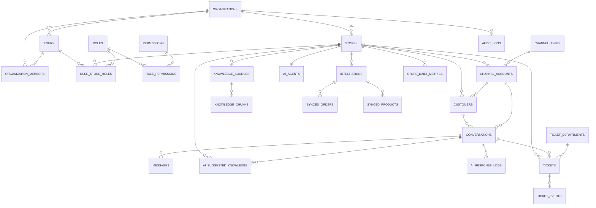

# تصميم قاعدة البيانات

**الحالة:** جاهز للمراجعة | **يعتمد عليه:** تصميم المعمارية ([02-architecture.md](02-architecture.md))

هذا المستند يغطي جميع الجداول اللازمة لتنفيذ الوثيقة الكاملة: المتاجر
والمستخدمون والصلاحيات، القنوات، صندوق الوارد الموحد، قاعدة المعرفة والذكاء
الاصطناعي، التذاكر، التكاملات، التقارير، وسجل النشاط. الأنواع مكتوبة بصيغة
PostgreSQL لأنه المقترح في وثيقة المعمارية (يدعم JSONB وRow-Level Security
وامتداد pgvector للذكاء الاصطناعي)، لكن التصميم المنطقي ينطبق على أي محرك SQL.

## 0. المبادئ الحاكمة للتصميم

1. **كل جدول يحمل بيانات متجر معيّن يحتوي عمود `store_id` إلزامي (NOT NULL).**
   هذا هو أساس شرط العزل (القسم 12 من الوثيقة) — لا يوجد استثناء.
2. **العزل مطبّق مرتين لا مرة واحدة:** مرة في طبقة التطبيق (كل استعلام يُقيَّد
   بمتجر المستخدم الحالي)، ومرة في قاعدة البيانات نفسها عبر
   Row-Level Security، بحيث لو حدث خطأ برمجي في طبقة التطبيق فلن يستطيع
   تسريب بيانات متجر آخر.
3. **الجذر التنظيمي (`organizations`) موجود من اليوم الأول** حتى لو كانت
   المرحلة الأولى تخدم مالكًا واحدًا فقط بستة متاجر. هذا هو ما يسمح بالتحول
   إلى SaaS لاحقًا بإضافة موديول تسجيل واشتراكات جديد، دون تعديل أي جدول من
   الجداول أدناه.
4. **القنوات والتكاملات جداول مرجعية (`channel_types`) وليست قيمة ثابتة
   (enum) داخل الكود** — إضافة قناة أو منصة تكامل جديدة مستقبلاً تعني إضافة
   صف جديد + Adapter، لا تعديل بنية الجداول (ينفّذ متطلب "إضافة قناة جديدة
   دون تعديل جوهري" في القسم 4 و11).
5. **لا حذف فعلي (hard delete) للبيانات التشغيلية** (محادثات، تذاكر،
   رسائل) — فقط حالات `archived`/`closed`، لأن التقارير وسجل النشاط يجب أن
   تبقى دقيقة تاريخيًا.

## 1. النطاق التنظيمي والمتاجر

```sql
organizations (
  id                uuid PRIMARY KEY DEFAULT gen_random_uuid(),
  name              text NOT NULL,
  slug              text NOT NULL UNIQUE,
  status            text NOT NULL DEFAULT 'active', -- active | suspended
  created_at        timestamptz NOT NULL DEFAULT now(),
  updated_at        timestamptz NOT NULL DEFAULT now()
)

stores (
  id                uuid PRIMARY KEY DEFAULT gen_random_uuid(),
  organization_id   uuid NOT NULL REFERENCES organizations(id),
  name              text NOT NULL,
  slug              text NOT NULL,
  timezone          text NOT NULL DEFAULT 'Asia/Riyadh',
  currency          text NOT NULL DEFAULT 'SAR',
  status            text NOT NULL DEFAULT 'active', -- active | paused | archived
  settings          jsonb NOT NULL DEFAULT '{}',    -- ساعات العمل، أسلوب الرد الافتراضي...
  created_at        timestamptz NOT NULL DEFAULT now(),
  updated_at        timestamptz NOT NULL DEFAULT now(),
  UNIQUE (organization_id, slug)
)
```

في المرحلة الأولى: صف واحد في `organizations` (مالك المتاجر الستة)، وستة
صفوف في `stores`.

## 2. المستخدمون والصلاحيات (RBAC مرن)

```sql
users (
  id                uuid PRIMARY KEY DEFAULT gen_random_uuid(),
  organization_id   uuid NOT NULL REFERENCES organizations(id),
  name              text NOT NULL,
  email             text NOT NULL UNIQUE,
  phone             text,
  password_hash     text NOT NULL,
  status            text NOT NULL DEFAULT 'active', -- active | disabled
  last_login_at     timestamptz,
  created_at        timestamptz NOT NULL DEFAULT now()
)

roles (
  id                uuid PRIMARY KEY DEFAULT gen_random_uuid(),
  key               text NOT NULL UNIQUE,   -- owner | store_manager | agent | ...
  name              text NOT NULL,
  scope             text NOT NULL,          -- 'organization' | 'store'
  is_system         boolean NOT NULL DEFAULT true,
  created_at        timestamptz NOT NULL DEFAULT now()
)

permissions (
  id                uuid PRIMARY KEY DEFAULT gen_random_uuid(),
  key               text NOT NULL UNIQUE,   -- مثال: conversations.reply, knowledge.approve
  module            text NOT NULL,          -- inbox | knowledge | tickets | settings | reports | users
  description       text NOT NULL
)

role_permissions (
  role_id           uuid NOT NULL REFERENCES roles(id),
  permission_id     uuid NOT NULL REFERENCES permissions(id),
  PRIMARY KEY (role_id, permission_id)
)

-- وصول على مستوى المؤسسة كاملة (المالك فقط، يرى كل المتاجر تلقائيًا)
organization_members (
  id                uuid PRIMARY KEY DEFAULT gen_random_uuid(),
  organization_id   uuid NOT NULL REFERENCES organizations(id),
  user_id           uuid NOT NULL REFERENCES users(id),
  role_id           uuid NOT NULL REFERENCES roles(id), -- scope='organization'
  created_at        timestamptz NOT NULL DEFAULT now(),
  UNIQUE (organization_id, user_id, role_id)
)

-- وصول مرن لكل متجر على حدة (مدير متجر / موظف)، يسمح بمنح أكثر من متجر لنفس المستخدم
user_store_roles (
  id                uuid PRIMARY KEY DEFAULT gen_random_uuid(),
  user_id           uuid NOT NULL REFERENCES users(id),
  store_id          uuid NOT NULL REFERENCES stores(id),
  role_id           uuid NOT NULL REFERENCES roles(id), -- scope='store'
  granted_by        uuid NOT NULL REFERENCES users(id),
  created_at        timestamptz NOT NULL DEFAULT now(),
  UNIQUE (user_id, store_id, role_id)
)
```

**كيف يحقق هذا "الصلاحيات المرنة" (القسم 5):** وصول المستخدم لأي متجر ليس
حقلاً ثابتًا على `users`، بل صفوف في `user_store_roles` — منح أو سحب وصول
متجر إضافي هو فقط إضافة/حذف صف، دون أي تعديل بنيوي. المالك لا يحتاج صفوفًا
في هذا الجدول أصلاً؛ عضويته في `organization_members` بدور `owner` تعطيه
تلقائيًا كل المتاجر الحالية والمستقبلية لنفس المؤسسة.

## 3. القنوات

```sql
channel_types (
  id                uuid PRIMARY KEY DEFAULT gen_random_uuid(),
  key               text NOT NULL UNIQUE, -- whatsapp | instagram | messenger | tiktok
  name              text NOT NULL,
  adapter_key       text NOT NULL,        -- يحدد أي Channel Adapter يُستخدم (انظر المعمارية)
  is_active         boolean NOT NULL DEFAULT true
)

channel_accounts (
  id                  uuid PRIMARY KEY DEFAULT gen_random_uuid(),
  store_id            uuid NOT NULL REFERENCES stores(id),
  channel_type_id     uuid NOT NULL REFERENCES channel_types(id),
  external_account_id text NOT NULL,   -- Phone Number ID / Page ID ...
  display_name        text NOT NULL,
  credentials_encrypted bytea NOT NULL, -- مشفّرة عبر Secrets Vault، انظر المعمارية §9
  webhook_verify_token  text,
  status              text NOT NULL DEFAULT 'connected', -- connected | disconnected | error
  connected_at        timestamptz,
  created_at          timestamptz NOT NULL DEFAULT now(),
  updated_at          timestamptz NOT NULL DEFAULT now(),
  UNIQUE (store_id, channel_type_id, external_account_id)
)
```

## 4. صندوق الوارد الموحد: العملاء، المحادثات، الرسائل

```sql
customers (
  id                uuid PRIMARY KEY DEFAULT gen_random_uuid(),
  store_id          uuid NOT NULL REFERENCES stores(id),
  channel_account_id uuid REFERENCES channel_accounts(id),
  external_id       text NOT NULL, -- معرّف العميل في القناة
  name              text,
  phone             text,
  email             text,
  metadata          jsonb NOT NULL DEFAULT '{}',
  created_at        timestamptz NOT NULL DEFAULT now(),
  updated_at        timestamptz NOT NULL DEFAULT now(),
  UNIQUE (store_id, channel_account_id, external_id)
)

conversations (
  id                  uuid PRIMARY KEY DEFAULT gen_random_uuid(),
  store_id            uuid NOT NULL REFERENCES stores(id),
  channel_account_id  uuid NOT NULL REFERENCES channel_accounts(id),
  customer_id         uuid NOT NULL REFERENCES customers(id),
  status              text NOT NULL DEFAULT 'open', -- open | pending | resolved | closed
  assigned_user_id    uuid REFERENCES users(id),
  ai_confidence_level text,        -- high | medium | low (آخر تقييم)
  last_message_at     timestamptz,
  created_at          timestamptz NOT NULL DEFAULT now(),
  updated_at          timestamptz NOT NULL DEFAULT now()
)

messages (
  id                uuid PRIMARY KEY DEFAULT gen_random_uuid(),
  conversation_id   uuid NOT NULL REFERENCES conversations(id),
  store_id          uuid NOT NULL REFERENCES stores(id), -- منسوخ عمدًا لتسريع RLS والاستعلامات
  sender_type       text NOT NULL, -- customer | ai | agent | system
  sender_user_id    uuid REFERENCES users(id),
  content           text NOT NULL,
  attachments       jsonb NOT NULL DEFAULT '[]',
  external_message_id text,
  created_at        timestamptz NOT NULL DEFAULT now()
)
```

## 5. قاعدة المعرفة ووكيل الذكاء الاصطناعي

```sql
knowledge_sources (
  id                uuid PRIMARY KEY DEFAULT gen_random_uuid(),
  store_id          uuid NOT NULL REFERENCES stores(id),
  type              text NOT NULL, -- pdf|word|excel|faq|webpage|product|shipping_policy|return_policy|chat_history
  title             text NOT NULL,
  file_url          text,
  raw_text          text,
  status            text NOT NULL DEFAULT 'processing', -- processing | active | archived
  created_by        uuid NOT NULL REFERENCES users(id),
  created_at        timestamptz NOT NULL DEFAULT now(),
  updated_at        timestamptz NOT NULL DEFAULT now()
)

-- مقاطع مُجزّأة ومُرمّزة (embeddings) لتغذية الذكاء الاصطناعي بأسلوب RAG
knowledge_chunks (
  id                uuid PRIMARY KEY DEFAULT gen_random_uuid(),
  store_id          uuid NOT NULL REFERENCES stores(id), -- ⚠ عمود الفصل الحرج لكل استعلام بحث
  source_id         uuid NOT NULL REFERENCES knowledge_sources(id),
  content           text NOT NULL,
  embedding         vector(1536) NOT NULL, -- امتداد pgvector
  metadata          jsonb NOT NULL DEFAULT '{}',
  created_at        timestamptz NOT NULL DEFAULT now()
)

ai_agents (
  id                        uuid PRIMARY KEY DEFAULT gen_random_uuid(),
  store_id                  uuid NOT NULL UNIQUE REFERENCES stores(id),
  name                      text NOT NULL,
  persona                   jsonb NOT NULL DEFAULT '{}', -- أسلوب ونبرة المتجر
  model_provider            text NOT NULL,
  model_name                text NOT NULL,
  confidence_threshold_high numeric NOT NULL DEFAULT 0.85,
  confidence_threshold_low  numeric NOT NULL DEFAULT 0.5,
  status                    text NOT NULL DEFAULT 'active', -- active | paused
  created_at                timestamptz NOT NULL DEFAULT now(),
  updated_at                timestamptz NOT NULL DEFAULT now()
)

-- حلقة التعلّم بالموافقة (القسم 6): رد الموظف يُقترح كمعرفة، ولا يُفعَّل إلا بموافقة مدير المتجر
ai_suggested_knowledge (
  id                uuid PRIMARY KEY DEFAULT gen_random_uuid(),
  store_id          uuid NOT NULL REFERENCES stores(id),
  conversation_id   uuid REFERENCES conversations(id),
  content           text NOT NULL,
  status            text NOT NULL DEFAULT 'pending_review', -- pending_review | approved | rejected
  reviewed_by       uuid REFERENCES users(id),
  reviewed_at       timestamptz,
  created_at        timestamptz NOT NULL DEFAULT now()
)

-- سجل قرارات بوابة الثقة، يغذّي تقارير "نسبة الرد الآلي" و"نسبة التصعيد"
ai_response_logs (
  id                uuid PRIMARY KEY DEFAULT gen_random_uuid(),
  store_id          uuid NOT NULL REFERENCES stores(id),
  conversation_id   uuid NOT NULL REFERENCES conversations(id),
  message_id        uuid REFERENCES messages(id),
  confidence_level  text NOT NULL, -- high | medium | low
  action_taken      text NOT NULL, -- answered | flagged_for_review | escalated_to_human
  created_at        timestamptz NOT NULL DEFAULT now()
)
```

## 6. التذاكر

```sql
ticket_departments (
  id                uuid PRIMARY KEY DEFAULT gen_random_uuid(),
  store_id          uuid NOT NULL REFERENCES stores(id),
  name              text NOT NULL,
  UNIQUE (store_id, name)
)

tickets (
  id                  uuid PRIMARY KEY DEFAULT gen_random_uuid(),
  store_id            uuid NOT NULL REFERENCES stores(id),
  conversation_id     uuid NOT NULL REFERENCES conversations(id),
  customer_id         uuid NOT NULL REFERENCES customers(id),
  department_id       uuid REFERENCES ticket_departments(id),
  assigned_user_id    uuid REFERENCES users(id),
  status              text NOT NULL DEFAULT 'open', -- open | in_progress | resolved | closed
  priority            text NOT NULL DEFAULT 'medium', -- low | medium | high | urgent
  escalation_reason   text,
  ai_recommendation   text,
  attachments         jsonb NOT NULL DEFAULT '[]',
  created_at          timestamptz NOT NULL DEFAULT now(),
  updated_at          timestamptz NOT NULL DEFAULT now(),
  resolved_at         timestamptz
)

ticket_events (
  id                uuid PRIMARY KEY DEFAULT gen_random_uuid(),
  ticket_id         uuid NOT NULL REFERENCES tickets(id),
  actor_user_id     uuid REFERENCES users(id), -- فارغ إن كان النظام/الذكاء الاصطناعي
  event_type        text NOT NULL, -- created | assigned | status_changed | commented | resolved
  payload           jsonb NOT NULL DEFAULT '{}',
  created_at        timestamptz NOT NULL DEFAULT now()
)
```

كل حقول التذكرة المطلوبة في القسم 8 (بيانات العميل، ملخص المحادثة، سبب
التصعيد، الأولوية، القسم، المرفقات، توصية الذكاء الاصطناعي) مغطاة: بيانات
العميل والملخص تُشتقّان من `customer_id`/`conversation_id` مباشرة بدل
تكرارها، والباقي أعمدة صريحة.

## 7. التكاملات مع منصات المتاجر

```sql
integrations (
  id                uuid PRIMARY KEY DEFAULT gen_random_uuid(),
  store_id          uuid NOT NULL REFERENCES stores(id),
  platform          text NOT NULL, -- salla | zid | shopify | woocommerce
  credentials_encrypted bytea NOT NULL,
  status            text NOT NULL DEFAULT 'connected', -- connected | error | disconnected
  last_synced_at    timestamptz,
  created_at        timestamptz NOT NULL DEFAULT now(),
  updated_at        timestamptz NOT NULL DEFAULT now(),
  UNIQUE (store_id, platform)
)

-- كاش محلي: يتيح للذكاء الاصطناعي الرد الفوري بحالة الطلب دون نداء API خارجي في كل رسالة
synced_orders (
  id                uuid PRIMARY KEY DEFAULT gen_random_uuid(),
  store_id          uuid NOT NULL REFERENCES stores(id),
  integration_id    uuid NOT NULL REFERENCES integrations(id),
  external_order_id text NOT NULL,
  customer_ref      text,
  status            text NOT NULL,
  tracking_url      text,
  raw_payload       jsonb NOT NULL DEFAULT '{}',
  synced_at         timestamptz NOT NULL DEFAULT now(),
  UNIQUE (store_id, integration_id, external_order_id)
)

synced_products (
  id                  uuid PRIMARY KEY DEFAULT gen_random_uuid(),
  store_id            uuid NOT NULL REFERENCES stores(id),
  integration_id      uuid NOT NULL REFERENCES integrations(id),
  external_product_id text NOT NULL,
  name                text NOT NULL,
  price               numeric,
  currency            text,
  sizes               jsonb NOT NULL DEFAULT '[]',
  raw_payload         jsonb NOT NULL DEFAULT '{}',
  synced_at           timestamptz NOT NULL DEFAULT now(),
  UNIQUE (store_id, integration_id, external_product_id)
)
```

## 8. التقارير

```sql
-- مجمّعة يوميًا (batch job)، تغذي لوحة المدير مباشرة بدل حساب التقارير حيًا من ملايين الرسائل
store_daily_metrics (
  id                       uuid PRIMARY KEY DEFAULT gen_random_uuid(),
  store_id                 uuid NOT NULL REFERENCES stores(id),
  metric_date              date NOT NULL,
  total_conversations      int NOT NULL DEFAULT 0,
  ai_resolved_count        int NOT NULL DEFAULT 0,
  escalated_count          int NOT NULL DEFAULT 0,
  avg_first_response_seconds int,
  top_questions            jsonb NOT NULL DEFAULT '[]',
  top_issues                jsonb NOT NULL DEFAULT '[]',
  created_at                timestamptz NOT NULL DEFAULT now(),
  UNIQUE (store_id, metric_date)
)
```

## 9. سجل النشاط (Audit Log)

```sql
audit_logs (
  id                uuid PRIMARY KEY DEFAULT gen_random_uuid(),
  organization_id   uuid NOT NULL REFERENCES organizations(id),
  store_id          uuid REFERENCES stores(id), -- NULL يعني حدثًا على مستوى المؤسسة
  actor_user_id     uuid REFERENCES users(id),
  action            text NOT NULL, -- user.login | ticket.assign | knowledge.approve | channel.connect ...
  entity_type       text NOT NULL,
  entity_id         uuid,
  before_state      jsonb,
  after_state       jsonb,
  ip_address        inet,
  created_at        timestamptz NOT NULL DEFAULT now()
)
```

## 10. استراتيجية العزل على مستوى قاعدة البيانات (RLS)

مثال تطبيقي على جدول `conversations` (يتكرر النمط نفسه على كل جدول يحمل
`store_id`):

```sql
ALTER TABLE conversations ENABLE ROW LEVEL SECURITY;

CREATE POLICY store_isolation ON conversations
  USING (
    store_id = ANY (
      string_to_array(current_setting('app.accessible_store_ids'), ',')::uuid[]
    )
  );
```

عند بداية كل طلب، تحسب طبقة التطبيق قائمة المتاجر المسموح بها للمستخدم
الحالي (كل المتاجر إن كان `owner`، أو المتاجر الموجودة له في
`user_store_roles` إن كان غير ذلك)، وتضبطها عبر
`SET LOCAL app.accessible_store_ids = '...'` قبل تنفيذ أي استعلام. بهذا
تكون هناك طبقتا حماية مستقلتان: منطق التطبيق + قاعدة البيانات، تحقيقًا
الحرفي لشرط "العزل غير القابل للتفاوض" (القسم 12 من الوثيقة).

## 11. مخطط العلاقات (ERD)



> ملاحظة: مخطط ERD مبسّط لإظهار العلاقات فقط. القائمة الكاملة للأعمدة
> والأنواع موجودة في الجداول أعلاه، وهي المرجع الرسمي عند التنفيذ.
