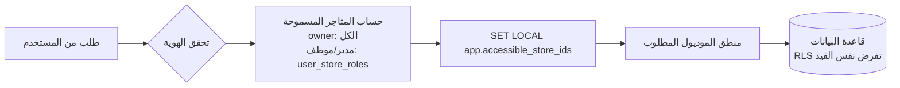
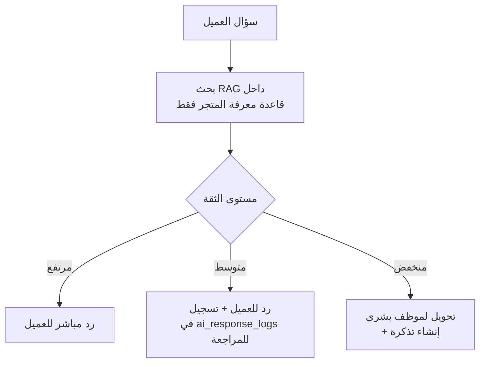
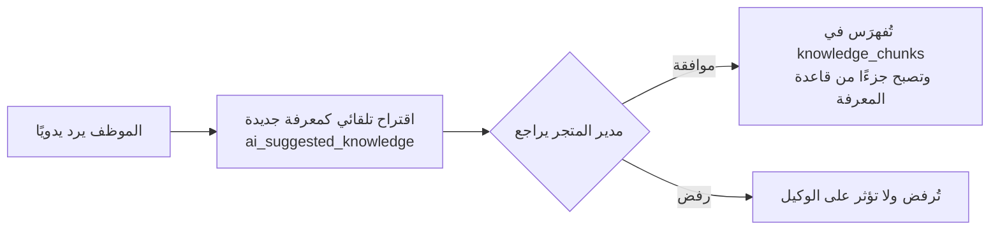
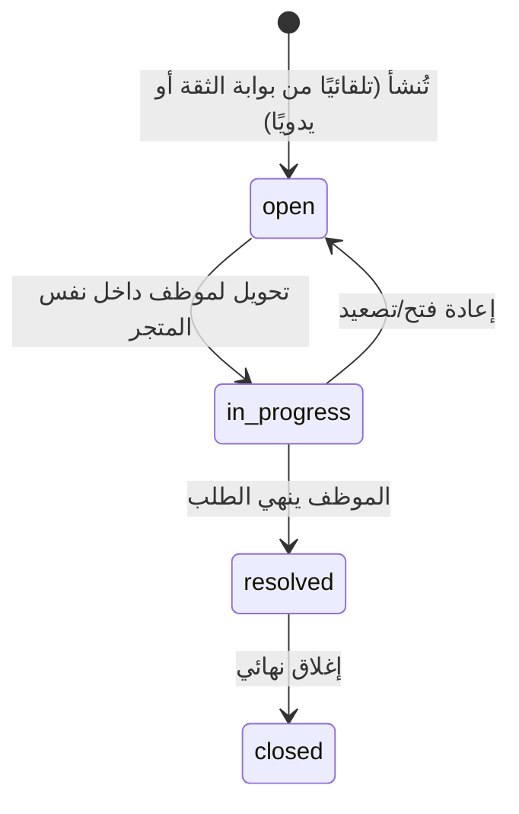

# المعمارية العامة للنظام

**الحالة:** جاهز للمراجعة | **يعتمد على:** [01-database-design.md](01-database-design.md)

## 1. النمط المعماري: Modular Monolith قابل للتفكك

النظام يُبنى كوحدة نشر واحدة (Monolith) في المرحلة الأولى — أسرع في البناء
والتشغيل والاختبار لمشروع بحجم 6 متاجر — لكن **مقسّم داخليًا إلى موديولات
مستقلة بحدود صريحة (Bounded Contexts)**، بحيث يمكن فصل أي موديول لاحقًا إلى
خدمة مستقلة عند الانتقال إلى SaaS دون إعادة كتابة منطق العمل:

| الموديول | المسؤولية |
|---|---|
| **Identity & Access** | المستخدمون، الأدوار، الصلاحيات، تسجيل الدخول |
| **Tenancy** | المؤسسات، المتاجر، الإعدادات العامة |
| **Channels & Inbox** | ربط القنوات، استقبال/إرسال الرسائل، صندوق الوارد الموحد |
| **Knowledge & AI** | قاعدة المعرفة، وكيل الذكاء الاصطناعي، بوابة الثقة |
| **Tickets** | إنشاء التذاكر، التحويل، دورة الحياة |
| **Store Integrations** | سلة/زد/Shopify/WooCommerce، مزامنة الطلبات والمنتجات |
| **Analytics & Reporting** | التقارير المجمّعة، لوحة المدير |
| **Audit** | سجل النشاط الشامل |

**القاعدة الصارمة بين الموديولات:** أي موديول يتواصل مع موديول آخر فقط عبر
واجهة داخلية معرّفة (Service Interface) أو حدث (Domain Event) — لا يوجد
استعلام SQL مباشر يتجاوز حدود موديول لموديول آخر. هذا ما يجعل الفصل
المستقبلي إلى خدمات منفصلة عملية هندسية بحتة (نقل كود) وليست إعادة تصميم.

## 2. استراتيجية Multi-Tenant

**الخيار المعتمد: قاعدة بيانات واحدة، مخطط واحد (Shared DB / Shared Schema)
+ عمود مُميِّز (`store_id` / `organization_id`) + Row-Level Security.**

لماذا هذا الخيار تحديدًا وليس بديلًا آخر:

| الخيار | التقييم |
|---|---|
| قاعدة بيانات مستقلة لكل متجر (DB-per-tenant) | يعزل تمامًا لكنه لا يتوسّع تشغيليًا لآلاف العملاء (SaaS مستقبلي) — كل ترحيل (migration) يتكرر N مرة |
| مخطط مستقل لكل متجر (Schema-per-tenant) | نفس مشكلة التوسّع، ويعقّد النسخ الاحتياطي والاستعلامات عبر المتاجر (تقارير المالك) |
| **مخطط مشترك + فصل منطقي (المعتمد)** | يتوسّع لآلاف العملاء بدون تغيير، يبسّط تقارير المالك عبر كل المتاجر، والعزل مضمون عبر RLS + طبقة التطبيق معًا (تفصيل في [01-database-design.md §10](01-database-design.md#10-استراتيجية-العزل-على-مستوى-قاعدة-البيانات-rls)) |

مسار الطلب: كل طلب API يحمل هوية المستخدم → طبقة Identity & Access تحسب
قائمة المتاجر المسموح بها → تُضبط كسياق طلب (`app.accessible_store_ids`) →
كل استعلام لاحق (تطبيق + RLS) مقيّد بهذه القائمة تلقائيًا.



## 3. طبقة القنوات: نمط Channel Adapter

كل قناة (واتساب، إنستغرام، ماسنجر، تيك توك) تُنفَّذ كـ Adapter يطبّق واجهة
موحدة واحدة، بحيث تُضاف قناة جديدة مستقبلاً بإضافة Adapter جديد فقط دون لمس
منطق المحادثات أو صندوق الوارد:

```
ChannelAdapter (واجهة موحدة)
  ├─ sendMessage(conversation, content)      → ترسل عبر API القناة الرسمي
  ├─ receiveWebhook(payload)                 → تستقبل من Webhook القناة
  └─ normalizeInbound(payload) → Message      → تحوّل صيغة القناة إلى شكل داخلي موحد

WhatsAppAdapter | InstagramAdapter | MessengerAdapter | TikTokAdapter
```

كل الرسائل الواردة، بعد التطبيع (`normalizeInbound`)، تدخل بنفس الشكل إلى
`conversations`/`messages` — منطق صندوق الوارد الموحد لا يعرف من أي قناة
أتت الرسالة، فقط يعرف "رسالة داخل محادثة تابعة لمتجر ما".

## 4. طبقة الذكاء الاصطناعي وقاعدة المعرفة

**العزل هنا هو الأكثر حرجًا في كامل النظام:** كل بحث RAG يُنفَّذ بفلتر
`store_id` إلزامي على مستوى بانِي الاستعلام نفسه (وليس فقط عبر RLS) — طبقة
حماية ثالثة خاصة بالذكاء الاصطناعي، لأن تسريب معرفة متجر A في رد على عميل
متجر B هو أخطر خرق ممكن لشرط العزل.

**بوابة الثقة (Confidence Gate)** — تُنفَّذ لكل رد قبل إرساله:



**حلقة التعلّم بالموافقة (لا تحديث تلقائي أبدًا):**



## 5. صندوق الوارد الموحد

طبقة تجميع فوق `conversations` تعرض، لكل مستخدم، محادثات كل القنوات ضمن
حدود المتاجر المسموحة له فقط. التحديث اللحظي عبر قناة Pub/Sub داخلية
(الرسالة الجديدة من أي Adapter تُبث لكل من يشاهد تلك المحادثة/ذلك المتجر).

## 6. دورة حياة التذكرة



كل انتقال حالة يُسجَّل كصف في `ticket_events` — هذا هو أساس تقارير "متوسط
زمن الحل" و"أكثر أسباب التصعيد" في لوحة المدير.

## 7. التكامل مع منصات المتاجر (سلة، زد، Shopify، WooCommerce)

نفس نمط Adapter المستخدم للقنوات، مطبّق هنا على منصات التجارة:

- **مزامنة فورية:** Webhook من المنصة عند تغيّر حالة الطلب.
- **مزامنة احتياطية:** استعلام دوري (polling) لسد أي فجوة تفوّت فيها الـ webhook.
- **كاش محلي (`synced_orders`/`synced_products`):** الذكاء الاصطناعي يقرأ من
  الكاش المحلي مباشرة عند الرد على "أين طلبي؟"، بدل نداء API خارجي بطيء في
  كل رسالة — أسرع وأكثر استقرارًا عند انقطاع المنصة الخارجية مؤقتًا.

## 8. الصلاحيات (RBAC) على مستويين

1. **مستوى البوابة (Gateway):** فحص سريع — هل يملك المستخدم أي صلاحية دخول
   لهذا المتجر أصلاً؟ (رفض مبكر بدون الوصول لطبقة الأعمال).
2. **مستوى الخدمة (Service):** فحص دقيق لكل عملية — هل صلاحيته تشمل هذا
   الإجراء تحديدًا؟ (مثال: موظف خدمة عملاء يملك `conversations.reply` لكن
   ليس `knowledge.approve`).

مصفوفة الأدوار الافتراضية (`roles` + `role_permissions` في قاعدة البيانات):

| الدور | النطاق | ماذا يرى وماذا يفعل |
|---|---|---|
| `owner` | مؤسسة كاملة | كل المتاجر، كل الصلاحيات، بلا استثناء |
| `store_manager` | متجر واحد (أو أكثر إن مُنح) | كل صلاحيات المتجر: محادثات، معرفة، تذاكر، إعدادات، تقارير |
| `agent` | متجر واحد (أو أكثر إن مُنح) | محادثات متجره فقط، الرد، معالجة التذاكر المحوّلة إليه |

## 9. الأمان والعزل

- تشفير أسرار القنوات والتكاملات (`credentials_encrypted`) عبر Secrets Vault
  مخصص، لا تُخزَّن كنص صريح مطلقًا.
- سجل تدقيق (`audit_logs`) لكل عملية حسّاسة: تسجيل دخول، تغيير صلاحية،
  موافقة على معرفة جديدة، ربط/فصل قناة أو تكامل.
- مبدأ **Default Deny**: أي وصول عبر المتاجر غير مصرَّح به صراحة يُرفض
  افتراضيًا (لا "وصول ضمني" لأي شيء).

## 10. الاقتراح التقني (قابل للنقاش مع فريق التنفيذ)

هذا اقتراح معقول ينسجم مع المعمارية أعلاه، وليس شرطًا مغلقًا — أي إطار عمل
خلفي مديولاري يدعم حقن الاعتماديات (DI) وفصل الموديولات يفي بالغرض:

- **الخلفية:** إطار عمل مديولاري (مثل NestJS على Node.js، أو FastAPI مع
  تقسيم موديولاري صارم على Python).
- **قاعدة البيانات:** PostgreSQL + امتداد `pgvector` (لتخزين تضمينات قاعدة
  المعرفة، انظر §5 من تصميم قاعدة البيانات).
- **الطابور/التخزين المؤقت:** Redis + طابور مهام (BullMQ أو RabbitMQ)
  للمهام غير المتزامنة: إرسال عبر القنوات، مزامنة التكاملات، فهرسة المعرفة.
- **تخزين الملفات:** تخزين متوافق مع S3 لمرفقات المحادثات وملفات قاعدة
  المعرفة (PDF/Word/Excel).
- **الواجهة الأمامية:** تطبيق SPA مديولاري (React/Next.js) — لوحة تحكم
  مركزية + واجهة Workspace لكل متجر.
- **الحاويات:** كل موديول يُبنى كحزمة داخلية مستقلة قابلة للتشغيل كخدمة
  منفصلة لاحقًا عبر Docker، دون تغيير حدود الكود.

## 11. المسار نحو SaaS لاحقًا

بما أن `organizations` والعزل على مستوى `store_id` موجودان من التصميم
الأول، فتفعيل SaaS مستقبلاً (تسجيل ذاتي لشركات جديدة، خطط اشتراك، فوترة)
يعني **إضافة موديولات جديدة فقط** (Billing، Self-Serve Onboarding، Plan
Limits) دون تعديل جدول واحد من الجداول الحالية أو منطق العزل القائم.

## 12. خارطة تنفيذ المرحلة الأولى (بالترتيب المعتمد)

1. ✅ تصميم قاعدة البيانات
2. ✅ تصميم المعمارية العامة (هذا المستند)
3. ⏳ تصميم تدفقات المستخدم وجميع واجهات الشاشات
4. ⏳ اعتماد المالك على التصميم والواجهات
5. ⏸ تطوير الخدمات الخلفية (Backend) حسب الموديولات أعلاه
6. ⏸ ربط القنوات الرسمية (واتساب، إنستغرام، ماسنجر، تيك توك)
7. ⏸ بناء نظام الذكاء الاصطناعي وقاعدة المعرفة
8. ⏸ بناء نظام التذاكر
9. ⏸ التكامل مع منصات المتاجر (سلة، زد، Shopify، WooCommerce)
10. ⏸ الاختبارات النهائية
11. ⏸ النشر والإطلاق

الخطوتان 3 و4 لم تبدآ بعد — هما الخطوة التالية قبل أي كود خلفي، حسب التوجيه
المعتمد في وثيقة المواصفات.
