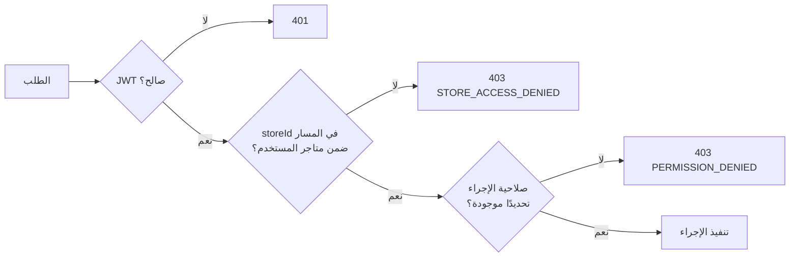

# تصميم الخدمات والواجهات البرمجية (API Contracts)

**الحالة:** جاهز للمراجعة | **يعتمد على:** [01-database-design.md](01-database-design.md), [02-architecture.md](02-architecture.md)

هذا هو عقد الواجهات بين الموديولات الثمانية المعرَّفة في المعمارية، وبين
الواجهة الأمامية والخلفية. لا كود تنفيذي هنا — فقط الشكل الملزم لكل نقطة
اتصال، حتى يبدأ **Senior Backend Engineer** و**Senior Frontend Engineer**
البناء من نفس العقد بالتوازي دون تصادم لاحق.

## 0. القواعد العامة (راجعها Backend Engineer + Security Architect معًا)

| القرار | لماذا |
|---|---|
| **إصدار صريح في المسار:** `/v1/...` | تغيير جذري لاحقًا يذهب لـ `/v2` دون كسر عملاء `/v1` — ضروري بمجرد وجود أكثر من عميل واجهة أمامية (ويب + احتمال تطبيق جوال لاحقًا) |
| **المتجر جزء من المسار، لا Header:** `/stores/{storeId}/conversations` | فحص الصلاحية يظهر صراحة في كل سطر لوغ وسجل تدقيق — Security Architect رفض تمريره كـ Header لأنه يسهّل نسيان التحقق منه في مكان ما |
| **Pagination بالمؤشر (Cursor) لا بالإزاحة (Offset)** | جداول مثل `messages` و`audit_logs` تنمو بسرعة؛ offset يتباطأ مع الحجم، والمؤشر ثابت الأداء — قرار Database Architect |
| **مغلّف استجابة موحّد** `{ data, meta, error }` | لا تركيب استجابة مختلف لكل موديول، الواجهة الأمامية تتعامل مع شكل واحد فقط |
| **مفتاح تكرار إلزامي (`Idempotency-Key`)** على أي طلب يرسل رسالة خارجية أو ينشئ سجلًا من webhook | قنوات مثل واتساب تُعيد إرسال نفس الـwebhook أحيانًا عند التأخر في الرد — بدون هذا المفتاح تتكرر الرسائل والتذاكر. قرار Integration Engineer بعد مراجعة سلوك إعادة المحاولة الموثّق لدى Meta |
| **حدّ معدل الطلبات (`429` + `Retry-After`)** لكل مؤسسة ولكل مستخدم | Security Architect: يمنع إساءة استخدام API الداخلي نفسه، ويحمي من كثافة webhooks غير متوقعة |

### شكل الخطأ الموحّد

```json
{
  "error": {
    "code": "STORE_ACCESS_DENIED",
    "message": "لا تملك صلاحية الوصول لهذا المتجر",
    "details": {}
  }
}
```

### شكل الصفحات (Pagination)

```json
{
  "data": [ /* ... */ ],
  "meta": { "next_cursor": "eyJpZCI6Ii4uLiJ9", "has_more": true }
}
```

## 1. Identity & Access

| Method | Path | الوصف |
|---|---|---|
| POST | `/v1/auth/login` | تسجيل الدخول، يُرجع JWT |
| POST | `/v1/auth/logout` | إبطال الجلسة |
| GET | `/v1/me` | بيانات المستخدم الحالي **+ قائمة المتاجر المسموح بها محسوبة سلفًا** (owner: الكل، غيره: من `user_store_roles`) — هذه القائمة هي مصدر بناء القائمة الجانبية والـ Store Switcher في الواجهة |
| GET | `/v1/organizations/{orgId}/users` | كل مستخدمي المؤسسة |
| POST | `/v1/organizations/{orgId}/users` | دعوة مستخدم جديد |
| POST | `/v1/organizations/{orgId}/users/{userId}/store-access` | منح وصول متجر `{ storeId, roleId }` — تنفيذ مباشر لـ"الصلاحيات المرنة" |
| DELETE | `/v1/organizations/{orgId}/users/{userId}/store-access/{storeId}` | سحب وصول متجر واحد فقط (لا يمس باقي متاجره) |
| GET | `/v1/roles`, `/v1/permissions` | القراءة فقط — التعديل عبر ترحيل بيانات (Migration) لا API، لأن الأدوار الأساسية ثابتة في MVP |

## 2. Tenancy

| Method | Path | الوصف |
|---|---|---|
| GET | `/v1/organizations/{orgId}` | بيانات المؤسسة |
| GET | `/v1/stores` | **المتاجر المسموحة للمستخدم الحالي فقط** — لا معامل تصفية يدوي، القائمة تُشتق من التوكن حصرًا |
| POST | `/v1/stores` | إنشاء متجر جديد (owner فقط) |
| GET / PATCH | `/v1/stores/{storeId}`, `/v1/stores/{storeId}/settings` | تفاصيل وإعدادات متجر واحد |

## 3. Channels & Inbox

| Method | Path | الوصف |
|---|---|---|
| GET | `/v1/stores/{storeId}/channel-accounts` | قنوات المتجر وحالتها |
| POST | `/v1/stores/{storeId}/channel-accounts` | بدء ربط قناة، يُرجع رابط OAuth الرسمي للقناة |
| POST | `/v1/stores/{storeId}/channel-accounts/{id}/verify` | تأكيد بعد عودة OAuth + إرسال رسالة اختبار (تدفق §6 في user-flows) |
| DELETE | `/v1/stores/{storeId}/channel-accounts/{id}` | فصل قناة |
| **POST** | **`/v1/webhooks/channels/{channelTypeKey}/{channelAccountId}`** | **نقطة استقبال واحدة موحّدة لكل القنوات.** إضافة قناة جديدة (مثال: Snapchat لاحقًا) لا تضيف مسارًا جديدًا، بل Adapter داخلي جديد يُسجَّل في `channel_types` ويعالج هذا المسار نفسه — هذا هو التنفيذ الحرفي لبند "إضافة قناة دون تعديل جوهري" |
| GET | `/v1/stores/{storeId}/conversations?status=&channel=&cursor=` | قائمة المحادثات (تبويبات صندوق الوارد) |
| GET | `/v1/stores/{storeId}/conversations/{id}/messages?cursor=` | سجل رسائل محادثة |
| POST | `/v1/stores/{storeId}/conversations/{id}/messages` | رد الموظف (يتطلب `Idempotency-Key`) |
| POST | `/v1/stores/{storeId}/conversations/{id}/summarize` | تلخيص فوري بالذكاء الاصطناعي |
| WS | `/v1/stores/{storeId}/realtime` | بث لحظي: رسالة جديدة، تغيّر حالة محادثة/تذكرة — يغذي صندوق الوارد دون تحديث الصفحة |

**ملاحظة أمان إلزامية (Security Architect):** كل طلب على مسار
`/webhooks/*` يُتحقق من توقيعه (HMAC حسب معيار كل منصة — مثال:
`X-Hub-Signature-256` لمنصات Meta) **قبل** أي لمس لقاعدة البيانات. توقيع
غير صالح = `401` فوري دون تنفيذ أي منطق. هذه المسارات عامة على الإنترنت
بطبيعتها، وهي أكثر نقطة تعرّض في كامل النظام.

## 4. Knowledge & AI

| Method | Path | الوصف |
|---|---|---|
| GET / POST | `/v1/stores/{storeId}/knowledge/sources` | مصادر المعرفة (رفع PDF/Word/Excel أو FAQ يدوي) |
| DELETE | `/v1/stores/{storeId}/knowledge/sources/{id}` | حذف/أرشفة مصدر |
| GET | `/v1/stores/{storeId}/knowledge/suggestions?status=pending_review` | قائمة المراجعة |
| POST | `/v1/stores/{storeId}/knowledge/suggestions/{id}/approve` \| `/reject` | فعل واحد لا رجعة فيه لكل اقتراح (يطابق تدفق §5) |
| GET / PATCH | `/v1/stores/{storeId}/ai-agent` | إعدادات الوكيل (الأسلوب، عتبات الثقة) |
| POST | `/v1/internal/ai/query` | **داخلي بين الموديولات فقط، غير مكشوف للواجهة الأمامية أو أي عميل خارجي** — يستدعيه موديول Channels & Inbox عند وصول رسالة عميل. وضعه تحت `/internal/` (يُرفض على بوابة API العامة) هو الحد المعماري الفعلي بين الموديولين، لا مجرد اصطلاح تسمية |

## 5. Tickets

| Method | Path | الوصف |
|---|---|---|
| GET | `/v1/stores/{storeId}/tickets?status=&priority=&department=&cursor=` | لوحة/قائمة التذاكر |
| POST | `/v1/stores/{storeId}/tickets` | إنشاء من محادثة (يدويًا أو من بوابة الثقة) |
| GET / PATCH | `/v1/stores/{storeId}/tickets/{id}` | التفاصيل، تغيير الحالة/الأولوية/التحويل (كل تغيير يُسجَّل في `ticket_events` تلقائيًا على مستوى الخدمة، لا الواجهة) |
| GET / POST | `/v1/stores/{storeId}/ticket-departments` | أقسام المتجر |

## 6. Store Integrations

| Method | Path | الوصف |
|---|---|---|
| GET / POST | `/v1/stores/{storeId}/integrations` | ربط سلة/زد/Shopify/WooCommerce |
| POST | `/v1/stores/{storeId}/integrations/{id}/sync` | مزامنة يدوية فورية (احتياطي عند تأخر webhook) |
| **POST** | **`/v1/webhooks/integrations/{platformKey}/{integrationId}`** | نفس فلسفة webhook القنوات — مسار ثابت موحّد لكل منصات التجارة، منصة جديدة = Adapter فقط |
| GET | `/v1/stores/{storeId}/orders/{externalOrderId}` | حالة طلب من الكاش المحلي (`synced_orders`) — هذا ما يستدعيه الذكاء الاصطناعي، لا نداء API خارجي مباشر |

## 7. Analytics & Reporting

| Method | Path | الوصف |
|---|---|---|
| GET | `/v1/organizations/{orgId}/reports/overview?range=7d` | مجمّع كل المتاجر (لوحة المالك) — للمالك فقط |
| GET | `/v1/stores/{storeId}/reports/daily?from=&to=` | تقرير متجر واحد، من `store_daily_metrics` المُجمَّعة مسبقًا (لا حساب حي من الرسائل الخام) |

## 8. Audit

| Method | Path | الوصف |
|---|---|---|
| GET | `/v1/organizations/{orgId}/audit-logs?store_id=&actor=&action=&cursor=` | قراءة فقط، لا تعديل ولا حذف عبر API أبدًا |

## 9. فحص الصلاحيات على كل طلب (بلا استثناء)

كل طلب يمر بالتسلسل التالي قبل الوصول لمنطق العمل — هذا امتداد مباشر
لتصميم RBAC على مستويين في المعمارية (§8):



## 10. ما بعد اعتماد هذا العقد

بعد مراجعة هذا المستند (Chief Architect + Backend Engineer + Frontend
Engineer + Security Architect)، يبدأ:

1. مراجعة تصميم شاملة لكل المستندات الخمسة السابقة معًا (قاعدة بيانات +
   معمارية + نظام تصميم + تدفقات + عقد API) — للتأكد من عدم وجود تعارض بين
   أي مستندين قبل أي كود.
2. بناء Backend حسب هذا العقد بالضبط، موديولاً موديولاً حسب الترتيب في
   [02-architecture.md §12](02-architecture.md).
3. بناء Frontend فوق نظام التصميم في [03-design-system.md](03-design-system.md)
   يستهلك نفس هذا العقد — لا عقد مختلف لكل طرف.
