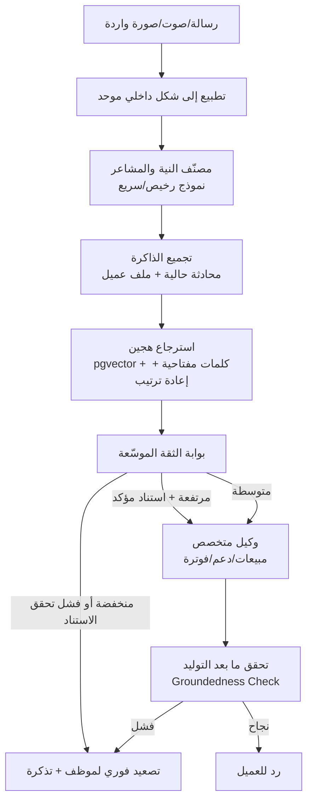
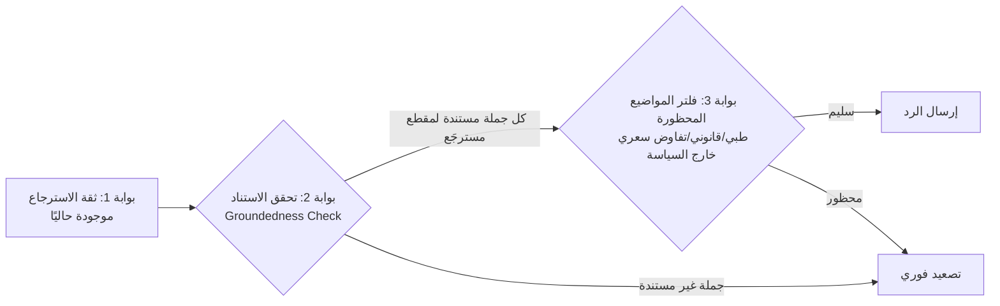
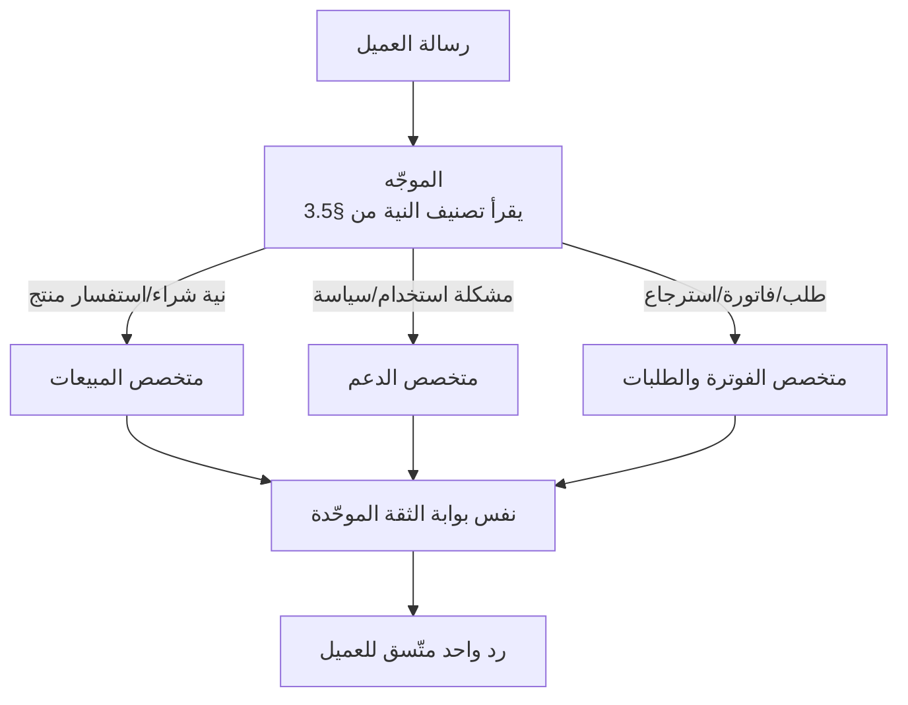

# تصميم محرك الذكاء الاصطناعي المتفوق

**الحالة:** مسودة للمراجعة | **يعتمد على:** [02-architecture.md](02-architecture.md)

## 0. نطاق هذا المستند ومنهجيته

هذا المستند يقارن قدرات الذكاء الاصطناعي المُعلنة علنًا لمنصة منافسة
(**GABSTER AI**) بأفضل الممارسات الصناعية الحديثة (2025–2026)، ثم يبني على
مفهوم **بوابة الثقة (Confidence Gate)** الموجود أصلاً في تصميم أطلس
([02-architecture.md §4](02-architecture.md#4-طبقة-الذكاء-الاصطناعي-وقاعدة-المعرفة))
لاقتراح محرك ذكاء اصطناعي أكثر نضجًا واستحقاقًا للثقة.

**قيود منهجية مهمة يجب الإفصاح عنها:**

- الوصول المباشر لصفحات `gabster.ai` من بيئة إعداد هذا المستند مُقيَّد على
  مستوى سياسة الشبكة الصادرة (كل محاولة اتصال مباشر بالنطاق رجعت 403 من
  البوابة الوسيطة)، لذا يعتمد التحليل أدناه على **مقتطفات مفهرَسة علنًا عبر
  محركات البحث** من صفحات الشركة (الرئيسية، صفحة المزايا، مدونتها) ومصادر
  ثانوية مستقلة (مواقع مقارنة تنافسية، تغطية إعلامية لجولة التمويل)، وليس
  مراجعة مباشرة كاملة للموقع الحي.
- كل ما يلي **ادعاءات عامة منشورة**، لا تفاصيل تنفيذ مؤكَّدة. حيثما لا يوجد
  مصدر علني واضح، يُصنَّف البند صراحة **"غير معلن"** ولا يُفترض أي تخمين حول
  البنية الداخلية الفعلية لـ GABSTER.
- الهدف ليس تحقيرًا لمنافس، بل استخلاص معيار سوقي معقول لتصميم محرك أطلس
  بجودة تتجاوزه بناءً على أساس هندسي واضح وقابل للتبرير.

**المصادر العلنية المستخدمة (بحسب فهرسة محركات البحث بتاريخ إعداد هذا
المستند):**

| المصدر | النوع |
|---|---|
| `gabster.ai/en` (الصفحة الرئيسية) | أول-طرف (تسويقي) |
| `gabster.ai/en/features`، `gabster.ai/en/features/ai-engine` | أول-طرف (تسويقي) |
| مدونة Gabster (مقالات مقارنة/دليل الذكاء الاصطناعي الوكيلي) | أول-طرف (تسويقي/تحريري) |
| `connectgain.cloud/en/compare/gabster` | ثالث-طرف (موقع مقارنة تنافسي — ادعاءاته عن Gabster **غير مؤكَّدة من Gabster نفسها**) |
| تغطية إعلامية لجولة التمويل (Technotrenz، Arab Founders، Dealroom) | إعلامي مستقل |
| صفحة التطبيق على Google Play | أول-طرف (وصف متجر تطبيقات) |

## 1. ما تُعلنه GABSTER AI علنًا عن وكلائها الذكيين

### 1.1 الادعاءات المُجمَّعة وتصنيفها

| المحور | الادعاء المنشور (بحسب المصادر أعلاه) | التصنيف |
|---|---|---|
| **الموقع التسويقي العام** | منصة "ذكاء اصطناعي لخدمة العملاء والمبيعات والتسويق" (نص وصوت)، تصف نفسها بأنها من أوائل منصات وكلاء الذكاء الاصطناعي في الشرق الأوسط | تسويقي بحت — عبارة تموضع سوقي، لا يمكن التحقق منها تقنيًا |
| **بناء الوكيل وقاعدة المعرفة** | "بناء وكيل ذكاء اصطناعي مخصّص مدرَّب على قاعدة معرفتك" عبر رفع مستندات أو لصق روابط أو ربط قاعدة معرفة قائمة؛ نشر أول وكيل خلال دقائق | تسويقي عالي المستوى — يصف تجربة الإعداد (UX) لا آلية الاسترجاع (RAG) الفعلية خلفه |
| **القنوات** | تجميع أكثر من 10 قنوات تواصل (واتساب، فيسبوك، إنستغرام، تيليجرام، بريد إلكتروني، دردشة حية) في صندوق وارد موحّد؛ تضمين عبر سطر سكربت واحد في الموقع | محدّد تقنيًا من ناحية العرض السطحي (Widget)، لكن آلية التوحيد الداخلية غير معلنة |
| **الصوت** | مدخل ومخرج صوتي، "محادثات طبيعية بزمن استجابة دون الثانية"، إمكانية تخصيص رقم هاتف حقيقي يتصل عليه العميل مباشرة | ادعاء محدد رقميًا (زمن استجابة) لكن **بلا كشف عن مزوّد ASR/TTS المستخدم أو ظروف القياس** — رقم تسويقي غير قابل للتحقق من مصدر مستقل |
| **الاحتفاظ بالسياق (Memory)** | تُذكر عبارة "ذاكرة سياقية" (context memory) في مصدر ثالث (`connectgain.cloud`)، **وليس على صفحات Gabster نفسها** ضمن ما وصلنا إليه | **غير مؤكَّد من الشركة نفسها** — ادعاء من موقع مقارنة تنافسي، يُنقل هنا للأمانة فقط مع تحفظ صريح |
| **دقة فهم النية (Intent)** | نفس المصدر الثالث يذكر رقم "95%+ دقة تمييز النية" | **غير مؤكَّد من الشركة نفسها**، رقم من طرف ثالث بلا منهجية قياس معلنة — لا يُعامَل كحقيقة |
| **الدعم متعدد اللهجات** | "معالجة لغة طبيعية عربية أولاً" (Arabic-first NLP) بتفاعلات "دقيقة وحسّاسة ثقافيًا" | تسويقي — لا تفاصيل عن آلية تمييز اللهجات أو النموذج المستخدم |
| **تكاملات التجارة** | تكامل أصلي مع سلّة وزد للإجابة على حالة الطلب واستفسارات تجارة إلكترونية أساسية | محدد نسبيًا (أسماء منصات معلنة)، لكن آلية المزامنة (فوري/دوري) وتصميم الكاش غير معلنين |
| **الذكاء الاصطناعي الوكيلي (Agentic AI)** | مقال مدونة يصف معالجة "استفسارات عربية معقدة بشكل مستقل"، وأتمتة حجز المواعيد وسير العمل والتقارير عبر اللغة الطبيعية | تسويقي/تحريري بمصطلح "وكيلي" رائج — بلا تفصيل عن التخطيط (planning)، أو حدود الاستقلالية، أو آليات التحقق قبل تنفيذ إجراء |
| **الرؤية/فهم الصور (Vision)** | لم يُعثر على ادعاء علني محدد ضمن المصادر التي وصلنا إليها | **غير معلن** |
| **الحواجز ضد الهلوسة (Guardrails)** | لم يُعثر على وصف تقني علني لآلية منع الهلوسة أو التحقق من الاستناد للمصدر (groundedness) | **غير معلن** |
| **منطق التصعيد للبشر** | لم يُعثر على وصف علني لعتبات ثقة محددة أو قواعد تصعيد | **غير معلن** |
| **توجيه النماذج (LLM Routing)** | لا كشف عن مزوّد أو نماذج الذكاء الاصطناعي المستخدمة خلف المنصة | **غير معلن** (سياسة شائعة لدى منصات SaaS تجارية — إخفاء طبقة النموذج) |
| **تعاون وكلاء متعددين (Multi-agent)** | لا وصف علني لمعمارية تعدد الوكلاء الداخلية | **غير معلن** |
| **التمويل والنضج المؤسسي** | جولة تمويل أولي (Pre-Seed) بقيمة 500 ألف دولار بمشاركة Al Rajhi International for Investment وT2 | معلومة إعلامية موثقة (ليست ادعاء تقني) — تُذكر كسياق فقط: مؤشر على شركة ناشئة حديثة النشأة نسبيًا |

### 1.2 الخلاصة

الصورة العلنية عن GABSTER هي صورة **منتج تسويقي متكامل القنوات** (صندوق
وارد موحّد، صوت، تكاملات سلّة/زد، تخصيص شخصية الوكيل) موجَّه لسوق الشرق
الأوسط بلغة عربية أولاً — وهذا تموضع سوقي معقول ومباشر. لكن **لا يوجد أي
كشف تقني علني** عن الجزء الذي يحدد فعليًا موثوقية الوكيل: آلية RAG، طبقات
منع الهلوسة، منطق التصعيد الدقيق، توجيه النماذج، أو معمارية تعدد الوكلاء.
هذا الغياب بالتحديد هو نقطة الانطلاق لتصميم أطلس أدناه: **جعل هذه الطبقة
بالذات — التي تبقى صندوقًا أسود عند المنافس — شفافة، قابلة للتدقيق،
ومبنية على مبدأ "الرفض بدل التخمين" كأساس تصميمي معلن ومُوثَّق داخليًا.**

## 2. أفضل الممارسات الصناعية 2025–2026 لوكلاء خدمة العملاء الإنتاجيين

هذه ممارسات عامة معروفة في صناعة الذكاء الاصطناعي التطبيقي (غير خاصة بأي
منافس بعينه)، وتُستخدم كخط أساس مقارنة لتصميم أطلس في القسم 3:

| المحور | الممارسة الحديثة |
|---|---|
| **معمارية RAG** | استرجاع هجين (Hybrid Search): تشابه متجهي (vector/pgvector أو ما يعادله) + بحث كلمات مفتاحية/BM25 كإشارة تكميلية، ثم **إعادة ترتيب (Re-ranking)** بنموذج مخصص قبل تمرير أفضل النتائج فقط للنموذج اللغوي — لا تعتمد الأنظمة الجادة على أفضل نتيجة واحدة فقط |
| **تقطيع المعرفة (Chunking)** | تقطيع دلالي (Semantic Chunking) مع تداخل (overlap) بين المقاطع، ووسم كل مقطع بميتاداتا (نوع: سياسة/منتج/إجراء، تاريخ التحديث) لترجيح المصادر الأحدث |
| **ضبط الهلوسة (Hallucination Guardrails)** | طبقات متعددة: تحقق ما بعد التوليد من أن كل جملة في الرد مستندة فعليًا لمقطع مسترجَع (Groundedness Check)، إلزام الاستشهاد بمصدر داخلي، ونمط "ارفض إن لم تكن واثقًا" بدل التخمين |
| **تصميم التصعيد للبشر** | تصعيد متعدد الإشارات: ثقة الاسترجاع + المشاعر (Sentiment) + طلب صريح من العميل للتحدث لموظف + تكرار فشل الحل + قيمة مالية للطلب (استرجاع كبير مثلاً) — لا يُبنى على إشارة ثقة وحيدة، مع **نقل كامل لسجل المحادثة** لحظة التسليم للموظف |
| **تنسيق تعدد الوكلاء** | نمط "موجّه + متخصصون" (Orchestrator + Specialist Sub-agents): وكيل موجّه يصنّف الطلب ويوجّهه لشخصية متخصصة (مبيعات/دعم/فوترة) ضمن نفس الخيط، بدل بوتات منفصلة تفقد السياق عند التبديل |
| **توجيه النماذج وضبط الكلفة** | مستويات نماذج (Tiered Models): نموذج صغير/رخيص للتصنيف السريع، نموذج متوسط للردود المُصاغة، نموذج أقوى فقط للحالات المعقدة/الغامضة؛ مع **التخزين المؤقت للـ Prompt** (Prompt Caching) لخفض كلفة الاستدعاءات المتكررة لنفس السياق |
| **إدارة نافذة السياق** | تلخيص متجدد (Rolling Summarization) للمحادثات الطويلة بدل حشو كامل التاريخ في كل استدعاء، وفصل الذاكرة قصيرة المدى (المحادثة الحالية) عن طويلة المدى (ملف العميل) |
| **أطر التقييم (Eval Harnesses)** | مجموعات اختبار ذهبية (Golden Sets) من أسئلة/إجابات معتمدة تُشغَّل بشكل دوري ضد أي تغيير في النموذج أو قاعدة المعرفة، أحيانًا بمساعدة "نموذج حكم" (LLM-as-judge) لتقييم الجودة آليًا، مع مراجعة بشرية دورية لعيّنات عشوائية من الردود الحية |

## 3. تصميم محرك أطلس المتفوق

### 3.1 مبدأ التصميم الجوهري

بوابة الثقة الحالية في أطلس تطبّق بالفعل الفكرة الأهم في الصناعة: **الرفض
والتصعيد بدل التخمين عند نقص الثقة**، وحلقة تعلّم بموافقة بشرية إلزامية
(لا تحديث تلقائي للمعرفة أبدًا). هذا أساس أمتن مما هو معلن علنًا عن أي
منافس. التصميم أدناه **يوسّع** هذا الأساس في ست جبهات دون كسره: الذاكرة،
الاسترجاع، ضبط الهلوسة، التصنيف والتصعيد، الصوت/الرؤية، توجيه النماذج،
وتعدد الوكلاء — مع إبقاء **عزل كل متجر** كقيد صارم غير قابل للتفاوض في كل
جبهة.



### 3.2 معمارية الذاكرة: قصيرة المدى + طويلة المدى لكل عميل

الوضع الحالي: كل استدعاء لـ `generateGroundedAnswer` يمرّر سؤالاً واحدًا
بلا أي سياق محادثة سابق (`backend/src/lib/llm.ts`) — كافٍ لسؤال منفرد لكن
غير كافٍ لمحادثة متعددة الأدوار. المقترح طبقتان، وكلاهما **مقيّدتان
بـ`store_id` كباقي النظام**:

**أ) ذاكرة المحادثة (قصيرة المدى):**

- ملخّص متجدد يُحدَّث كل عدد ثابت من الرسائل (مثلاً كل 6 رسائل) بدل حشو
  كامل تاريخ المحادثة في كل استدعاء للنموذج — يضبط الكلفة ونافذة السياق
  معًا.
- يُقترح تخزينه في عمود `ai_memory_summary jsonb` على `conversations`
  (أو جدول `conversation_ai_summaries` منفصل إن أُريد الاحتفاظ بنسخ
  تاريخية للتدقيق) — يُحذف/يُصفَّر تلقائيًا عند إغلاق التذكرة المرتبطة.
- هذه الذاكرة **لا تُخزَّن كمعرفة عامة** ولا تدخل فهرس RAG — هي سياق
  محادثة واحدة فقط، معزولة بـ `conversation_id`.

**ب) ملف العميل طويل المدى:**

- جدول مقترح `customer_ai_profiles (store_id, customer_id, preferences,
  recurring_topics, tone_preference, last_updated_at)` — يُبنى من بيانات
  **سلوكية وهيكلية** (تفضيل قناة، نبرة تواصل، تكرار سؤال معيّن) وليس من
  نص حر غير مُتحقَّق منه.
- **تمييز جوهري يحافظ على مبدأ "لا تحديث تلقائي للمعرفة":** تحديث ملف
  العميل (تفضيلات شخصية غير معمَّمة) يمكن أن يكون شبه-تلقائي لأنه لا
  يؤثر على أي عميل آخر ولا يُغيّر ما يُقال باسم المتجر؛ أما أي نمط متكرر
  من ملفات عملاء متعددين قد يشير إلى **ثغرة أو نقص في قاعدة المعرفة نفسها**
  فيُرفَع كاقتراح إلى نفس حلقة `ai_suggested_knowledge` القائمة لمراجعة
  مدير المتجر — الخط الفاصل بين "تخصيص لعميل واحد" و"معرفة عامة عن المتجر"
  يبقى محكومًا بالموافقة البشرية دائمًا.
- ملف العميل يُستخدم **كسياق إضافي** يُمرَّر لطبقة الصياغة (وليس كمصدر
  حقائق) — لا يجوز أبدًا أن يستند الرد على معلومة من ملف العميل تتعارض مع
  قاعدة المعرفة الرسمية للمتجر؛ قاعدة المعرفة تبقى دائمًا المرجع الحاكم.

### 3.3 تحسين خط أنابيب الاستيعاب والاسترجاع (RAG)

الاسترجاع الحالي في `backend/src/modules/knowledge/retrieval.ts` تراكب
كلمات بسيط ومقصود كنقطة انطلاق قابلة للتبديل (التعليق في الملف نفسه يشير
إلى عمود `embedding vector(1536)` الجاهز في `knowledge_chunks` بانتظار
التفعيل). المقترح لمرحلة النضج:

1. **استرجاع هجين:** تشابه متجهي عبر `pgvector` (Cosine/HNSW index) +
   نفس منطق تراكب الكلمات الحالي كإشارة ثانوية — الدمج يعالج حالات
   المصطلحات الحرفية (أكواد منتجات، أرقام) التي يضعفها البحث المتجهي وحده.
2. **استرجاع متعدد المقاطع لا مقطعًا واحدًا:** استبدال `retrieveBestChunk`
   بدالة تُرجع أفضل K مقاطع (مثلاً 3–5) ضمن ميزانية رمزية (token budget)
   محددة، بدل الاكتفاء بأفضل نتيجة — أسئلة كثيرة تحتاج دمج معلومة من أكثر
   من مقطع (مثال: سياسة الاسترجاع + مدة الشحن معًا).
3. **إعادة ترتيب خفيفة قبل التوليد:** خطوة رخيصة (نموذج تصنيف صغير أو حتى
   دالة ترجيح قائمة على حداثة المصدر ونوعه من `metadata`) لإعادة ترتيب
   المرشحين قبل تمريرهم للنموذج اللغوي.
4. **الاستشهاد الإلزامي:** يُطلب من طبقة الصياغة الإشارة إلى معرّف كل
   مقطع استندت إليه؛ الرد لا يُرسل إن أشار لمعرّف غير موجود ضمن المقاطع
   المسترجَعة فعليًا — هذا هو أساس تحقق الاستناد في §3.4.
5. **الفصل الحرج يبقى كما هو:** كل استعلام استرجاع — بغض النظر عن كونه
   متجهيًا أو كلماتيًا أو هجينًا — يمرّ عبر فلتر `store_id` إلزامي على
   مستوى بانِي الاستعلام نفسه، تمامًا كما هو موثّق في
   [02-architecture.md §4](02-architecture.md#4-طبقة-الذكاء-الاصطناعي-وقاعدة-المعرفة).
   لا فهرس مشترك بين المتاجر تحت أي ذريعة أداء أو "تشابه منتجات".

### 3.4 بوابة الثقة الموسّعة وضوابط الهلوسة

بوابة الثقة الحالية (`aiPipeline.ts`) تحسب مستوى ثقة واحد من درجة
الاسترجاع فقط. المقترح: **طبقتان إضافيتان بعد التوليد**، بحيث يصبح القرار
النهائي محكومًا بثلاث بوابات متتالية لا بوابة واحدة:



- **بوابة الاستناد (Groundedness Check):** بعد توليد الرد، تحقق آلي
  (يمكن أن يكون نموذجًا رخيصًا منفصلاً، أو حتى تحقق استشهادات نصي بسيط في
  المرحلة الأولى) من أن كل ادعاء في الرد موجود فعلاً في المقاطع
  المسترجَعة — أي انحراف يُسقط الرد تلقائيًا لمسار التصعيد، بصرف النظر عن
  مستوى الثقة الأصلي.
- **بوابة المواضيع المحظورة:** قائمة قابلة للتهيئة لكل متجر (نصائح
  طبية/قانونية، تفاوض سعر خارج السياسة المعلنة، الحديث بالنيابة عن منافس)
  — أي تطابق يوقف الرد الآلي فورًا.
- **مبدأ ثابت من التصميم الحالي ويبقى كما هو:** لا تغيير تلقائي لسلوك
  الوكيل بناءً على هذه البوابات — أي نمط تصعيد متكرر يُغذّي تقارير
  `ai_response_logs` ويُعرض على مدير المتجر، لا يُصلَح النظام نفسه تلقائيًا.

### 3.5 تصنيف النية والتصعيد

خطوة تصنيف مسبقة (قبل الاسترجاع) بنموذج رخيص/سريع لتحديد:

| البُعد | القيم المقترحة |
|---|---|
| **النية** | سؤال عام، حالة طلب، شكوى، نية شراء، طلب استرجاع/استبدال، طلب صريح للتحدث مع موظف، محتوى حسّاس/غير متعلق بالمتجر |
| **الاستعجال/المشاعر** | عادي، متضايق، غاضب/عاجل |

**جدول قواعد التصعيد (يدمج الإشارات بدل الاعتماد على مستوى ثقة وحيد):**

| الشرط | الإجراء |
|---|---|
| ثقة الاسترجاع منخفضة (كما هو حاليًا) | تصعيد + تذكرة (سلوك قائم، بلا تغيير) |
| فشل بوابة الاستناد بعد التوليد | تصعيد فوري بصرف النظر عن مستوى الثقة الأصلي |
| طلب العميل صريحًا التحدث لموظف | تصعيد فوري، حتى لو كانت الثقة مرتفعة |
| مشاعر غاضبة/عاجلة + فشل حل سابق في نفس المحادثة | تصعيد بأولوية `urgent` في `tickets.priority` |
| نية "استرجاع/استبدال" تتجاوز سقفًا ماليًا قابلاً للتهيئة لكل متجر | تصعيد إلزامي (قرار مالي لا يُترك لوكيل آلي) |
| محتوى حسّاس/طبي/قانوني | رفض صريح + تصعيد (بوابة §3.4) |

هذا التصنيف نفسه هو أول استخدام لتوجيه النماذج (§3.7): مهمة تصنيف بسيطة
لا تستدعي نفس النموذج المستخدم لصياغة رد كامل.

### 3.6 خارطة طريق الصوت والرؤية

تُبنى كلتاهما فوق نمط `ChannelAdapter` القائم فعلاً
([02-architecture.md §3](02-architecture.md#3-طبقة-القنوات-نمط-channel-adapter))
— دون إضافة مسار معالجة موازٍ يتجاوز بوابة الثقة:

**الصوت:**

1. **المرحلة 1:** `VoiceAdapter` يحوّل الصوت الوارد إلى نص عبر تحويل كلام
   إلى نص (ASR) بمزوّد يدعم اللهجات العربية، ثم يمرّر النص الناتج
   **كرسالة عادية** لنفس خط أنابيب `aiPipeline.ts` — الوكيل لا "يعرف" أنه
   يتحدث صوتيًا، وبوابة الثقة نفسها تُطبَّق بلا استثناء.
2. **المرحلة 2:** تحويل الرد النصي المعتمَد فقط (بعد اجتيازه كل بوابات
   §3.4) إلى صوت (TTS) — لا يُنطق أبدًا نص لم يمرّ بالبوابة.
3. **المرحلة 3:** مكالمات هاتفية مباشرة عبر رقم مخصص لكل متجر — نفس
   الأنبوب، زمن استجابة أدق فقط.

**الرؤية (فهم الصور):**

1. صور واردة (صورة منتج، صورة عطل/شكوى، صورة إيصال لطلب استرجاع) تدخل
   عبر `Channels & Inbox` كنوع مرفق مطبَّع، تمامًا كالنصوص.
2. نموذج فهم صور يُستخرج منه **وصف نصي هيكلي** (لا حكم نهائي) — هذا
   الوصف هو ما يدخل كـ"سؤال" إلى بوابة الثقة والاسترجاع، بنفس القيود
   تمامًا: **لا يُسمح لنموذج الرؤية بالإجابة مباشرة عن سياسة المتجر من
   عنده** — فقط استخراج ما في الصورة، ثم الإجابة تأتي من قاعدة معرفة
   المتجر كالمعتاد.
3. حالة استخدام أولى مقترحة: التحقق الآلي من صور طلبات الاسترجاع/الاستبدال
   كمدخل مساعد لموظف التذاكر، لا كقرار آلي نهائي.

### 3.7 استراتيجية توجيه النماذج (LLM Routing)

الوضع الحالي في `backend/src/lib/llm.ts`: مزوّد واحد (Anthropic)، نموذج
واحد قابل للتهيئة عبر متغير بيئة، وسقوط أنيق (`return null`) لنص المعرفة
الخام عند غياب المفتاح — تصميم بسيط وسليم كنقطة بداية. التوسعة المقترحة
تُبقي نفس فلسفة "السقوط الآمن" وتضيف طبقة توجيه:

```
ModelProvider (واجهة موحدة، بنفس روح ChannelAdapter)
  ├─ classify(text) → تصنيف نية/مشاعر سريع ورخيص
  ├─ generateGroundedAnswer(...) → صياغة رد مستند (الحالي، بلا تغيير في العقد)
  └─ verifyGroundedness(answer, chunks) → تحقق ما بعد التوليد

AnthropicProvider | (مزوّدات إضافية اختيارية للتكرار والتعافي)
```

| المهمة | فئة النموذج المقترحة | السبب |
|---|---|---|
| تصنيف النية/المشاعر (§3.5) | نموذج صغير/سريع (فئة Haiku أو معادلها) | حجم استدعاء ضخم (كل رسالة واردة)، لا يحتاج قدرة توليد نص طويل |
| صياغة الرد المستند (الحالي) | نموذج متوسط (فئة Sonnet، وهو الافتراضي الحالي `claude-sonnet-5`) | توازن جودة/كلفة لصياغة ودّية دقيقة |
| تحقق الاستناد بعد التوليد (§3.4) | نموذج صغير أو قواعد نصية مباشرة | مهمة تحقق مقيَّدة لا توليد حر، لا تستدعي نموذجًا كبيرًا |
| حالات معقدة يقررها المصنّف (تفاوض مبيعات متعدد الأدوار، صياغة رد لتذكرة مصعَّدة كمسودة مساعدة للموظف) | نموذج أقوى (فئة Opus) عند الحاجة فقط | يُستدعى فقط عند تصنيف الطلب كمعقد — لا كافتراض دائم |

**ضبط الكلفة إضافيًا:**

- **تخزين مؤقت للسياق الثابت (Prompt Caching):** شخصية المتجر ونصوص
  قاعدة المعرفة المتكررة ضمن نفس المحادثة تُخزَّن مؤقتًا بدل إعادة إرسالها
  كاملة في كل استدعاء.
- **سلسلة تعافٍ (Fallback Chain):** عند فشل/تعطل المزوّد الأساسي، سقوط
  لمزوّد بديل إن كان مهيَّأً، وإلا سقوط لنص المعرفة الخام كما هو الحال
  اليوم عند غياب المفتاح — **لا ينقطع الرد للعميل أبدًا بسبب عطل مزوّد
  واحد**.
- **سقف استهلاك لكل متجر:** حد أقصى قابل للتهيئة من قِبل مالك المتجر
  (تُغذّي `Analytics & Reporting`)، مع تنبيه عند الاقتراب منه بدل إيقاف
  مفاجئ للخدمة.

### 3.8 نموذج تعاون الوكلاء المتعددين

المقترح **ليس** بوتات منفصلة لكل غرض (تفقد السياق عند التبديل بينها)، بل
**وكيل منطقي واحد بمنظور العميل**، بشخصيات تخصصية داخلية تحت نفس خيط
المحادثة — يتوافق تمامًا مع مفهوم "صندوق وارد موحّد" القائم أصلاً:



- الموجّه يستخدم مخرجات تصنيف النية (§3.5) لاختيار الشخصية المناسبة —
  الشخصيات تختلف في **الصياغة والأولوية على نوع المعرفة** (مثال: متخصص
  الفوترة يُرجّح مقاطع `metadata.type = "policy"` المتعلقة بالدفع/الاسترجاع)،
  وليس في صلاحيات وصول مختلفة.
- **كل الشخصيات تشترك في نفس فهرس معرفة المتجر ونفس بوابة الثقة** — لا
  يوجد "متخصص" له استثناء من التصعيد عند ضعف الثقة أو فشل تحقق الاستناد؛
  هذا يمنع أكبر خطر في تعدد الوكلاء: تفاوت مستوى الحذر بين شخصية وأخرى.
  والفوترة/الاسترجاع تحديدًا محكومة أيضًا بقاعدة السقف المالي في §3.5
  التي تصعّد للبشر بصرف النظر عن ثقة النموذج.
- من منظور العميل، المحادثة تبقى متصلة وموحّدة (خيط `conversation_id`
  واحد) — أي تبديل شخصية داخلي غير مرئي للعميل ولا يُنشئ محادثة جديدة.
- كل انتقال بين الشخصيات يُسجَّل (توسعة منطقية لـ`ai_response_logs`) لأغراض
  التدقيق وتحسين قواعد التوجيه لاحقًا.

### 3.9 الاتساق مع نموذج العزل لكل متجر

كل إضافة في هذا التصميم تخضع لنفس القيد الحاكم في
[02-architecture.md §4](02-architecture.md#4-طبقة-الذكاء-الاصطناعي-وقاعدة-المعرفة):

| المكوّن الجديد | كيف يبقى معزولاً بحدود المتجر |
|---|---|
| ذاكرة المحادثة وملف العميل (§3.2) | مفتاح `store_id` إلزامي في كل جدول جديد، بنفس طبقات الحماية الثلاث (تطبيق + RLS + فلتر بانِي استعلام الذكاء الاصطناعي) |
| فهرس RAG الهجين (§3.3) | لا فهرس متجهي مشترك بين المتاجر تحت أي ذريعة أداء — فهرس/استعلام مقيَّد بـ`store_id` لكل متجر على حدة |
| إعدادات التصعيد والسقف المالي (§3.5) | حقول قابلة للتهيئة **لكل متجر** ضمن `ai_agents`، لا قيمة عامة موحّدة للنظام كله |
| الصوت والرؤية (§3.6) | تُفعَّل/تُعطَّل لكل متجر عبر نفس جدول إعدادات الوكيل — متجر يمكنه إيقاف الصوت كليًا دون أثر على غيره |
| توجيه النماذج (§3.7) | مفتاح المزوّد والحد الأقصى للاستهلاك يمكن تخصيصهما لكل متجر (خطة اشتراك مختلفة لاحقًا في مسار SaaS) |
| الشخصيات المتخصصة (§3.8) | كلها تستعلم فهرس معرفة **نفس المتجر فقط** — لا تُشارك سياقًا أو نتائج استرجاع عبر حدود متجر لآخر بأي حال |

### 3.10 خارطة تنفيذ مرحلية

تُدرَج هذه كخطوات فرعية داخل الخطوة 7 الحالية من خارطة
[02-architecture.md §12](02-architecture.md#12-خارطة-تنفيذ-المرحلة-الأولى-بالترتيب-المعتمد)
("بناء نظام الذكاء الاصطناعي وقاعدة المعرفة")، بلا تغيير في ترتيب المراحل
الكبرى المعتمد أصلاً:

1. ⏸ تفعيل الاسترجاع الهجين (pgvector + كلمات مفتاحية) بدل تراكب الكلمات
   وحده، واسترجاع متعدد المقاطع بدل مقطع واحد (§3.3).
2. ⏸ إضافة بوابتي الاستناد والمواضيع المحظورة بعد التوليد (§3.4).
3. ⏸ تصنيف النية/المشاعر كخطوة مسبقة رخيصة، وتفعيل جدول قواعد التصعيد
   الموسّع (§3.5).
4. ⏸ ذاكرة المحادثة (ملخّص متجدد) — أولوية أعلى من ملف العميل طويل المدى
   لأنها تحل مشكلة أوضح (محادثات متعددة الأدوار) بمخاطر أقل (§3.2-أ).
5. ⏸ طبقة توجيه النماذج متعددة المستويات وسلسلة التعافي (§3.7).
6. ⏸ ملف العميل طويل المدى، مربوطًا بحلقة الموافقة القائمة عند تقاطعه مع
   معرفة عامة (§3.2-ب).
7. ⏸ الشخصيات المتخصصة المتعددة تحت موجّه واحد (§3.8) — تُبنى فوق تصنيف
   النية الجاهز من الخطوة 3، فلا قيمة من تقديمها قبله.
8. ⏸ الصوت (مرحلة 1: تحويل كلام-لنص عبر نفس الأنبوب) — بعد استقرار بوابة
   الثقة الموسّعة، لأن الصوت يرفع حجم الرسائل الواردة دون رفع دقتها تلقائيًا.
9. ⏸ الرؤية/فهم الصور، كحالة استخدام مساعدة لموظف التذاكر أولاً قبل أي
   رد آلي مباشر مبني على صورة.

## 4. لماذا هذا التصميم متفوّق فعليًا لا تسويقيًا فقط

| المعيار | GABSTER (بحسب المعلن علنًا فقط) | تصميم أطلس المقترح |
|---|---|---|
| الشفافية التقنية لآلية منع الهلوسة | غير معلنة | موثّقة صراحة كبوابات متتالية قابلة للتدقيق (§3.4) |
| حلقة تعلّم المعرفة | غير معلنة | موافقة بشرية إلزامية موثّقة، بلا تحديث تلقائي أبدًا (قائم، ويُحافَظ عليه في كل توسعة) |
| عزل بيانات المتاجر | غير معلن كيفية ضمانه هندسيًا | ثلاث طبقات حماية موثّقة (تطبيق + RLS + فلتر إلزامي لكل استعلام ذكاء اصطناعي) تمتد لكل مكوّن جديد (§3.9) |
| منطق التصعيد | غير معلن (عتبات/قواعد) | جدول قواعد صريح متعدد الإشارات، قابل للتهيئة لكل متجر (§3.5) |
| تعدد الوكلاء | غير معلن إن وُجد أصلاً | نموذج موجّه/متخصصين موثّق، بلا تفاوت في الحذر بين الشخصيات (§3.8) |
| توجيه النماذج وضبط الكلفة | غير معلن (مزوّد/نماذج غير مكشوفة) | استراتيجية مستويات صريحة + سلسلة تعافٍ + سقف استهلاك لكل متجر (§3.7) |

الفارق الجوهري ليس فقط في القدرات المضافة (ذاكرة، صوت، رؤية، تعدد وكلاء)
— بل في أن كل قدرة في تصميم أطلس **موثّقة، قابلة للمراجعة الهندسية، ومقيّدة
بنفس مبدأ الأمان الذي حكم النظام منذ التصميم الأول**، بدل صندوق أسود
تسويقي كما هو حال المعلومات المتاحة عن المنافس.
