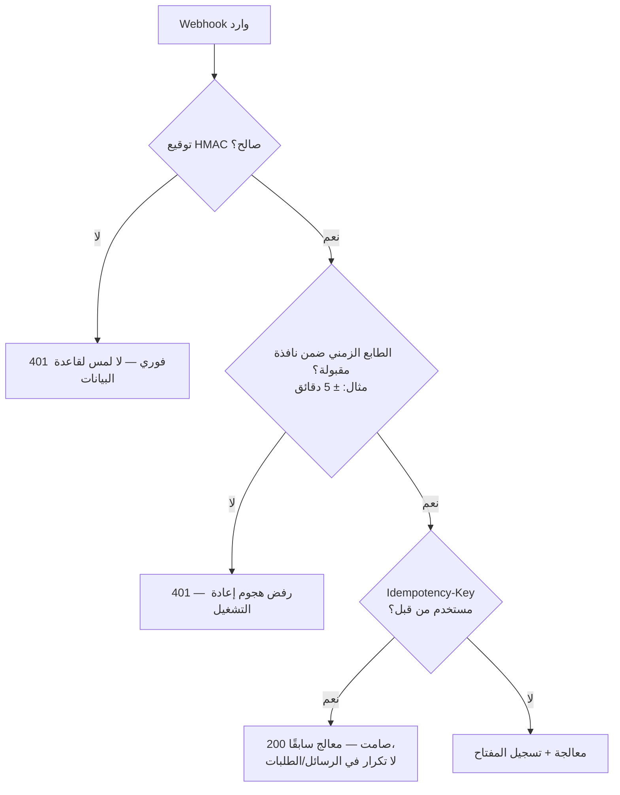
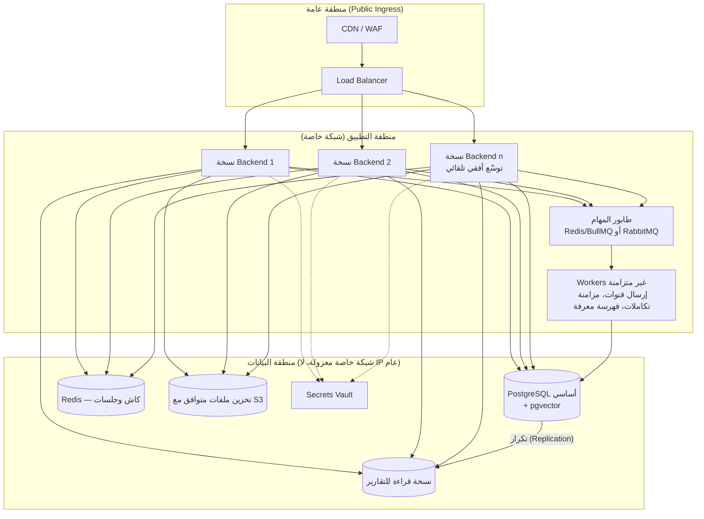
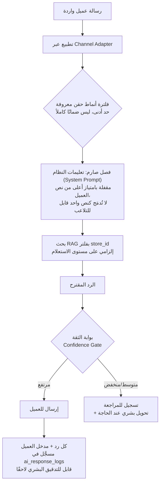

# تصميم الأمان والامتثال والبنية التحتية

**الحالة:** جاهز للمراجعة | **يعتمد على:** [01-database-design.md](01-database-design.md), [02-architecture.md](02-architecture.md)

هذا الفصل لا يعيد فتح أي قرار معتمد سابقًا — **المشاركة في مخطط واحد + عزل
منطقي عبر `store_id` + Row-Level Security** (القرار الموثّق في
[02-architecture.md §2](02-architecture.md#2-استراتيجية-multi-tenant)) هي
الأساس الثابت الذي يُبنى عليه كل ما يلي. الهدف هنا هو **التصليب**
(Hardening): كيف تُترجَم هذه الأسس إلى ضمانات أمنية وتشغيلية وقاعدة بيانات
على مستوى مؤسسي (Enterprise-Grade)، بحيث يكون الوضع الأمني والتشغيلي لأطلس
عند إطلاقه كـ SaaS أقوى من الحد الذي تضعه منصات المنافسة المباشرة (GABSTER
AI) والمنصات العالمية القابلة للمقارنة (Intercom، Zendesk، HubSpot).

**ملاحظة منهجية مهمة:** كل ما يرد في هذا الفصل عن GABSTER أو أي منافس آخر هو
إما (أ) معيار صناعي عام معروف علنًا (مثل كون Intercom وZendesk وHubSpot تُعلن
شهادات SOC 2 Type II وISO 27001 والامتثال لـ GDPR على صفحات الثقة العامة
الخاصة بها)، أو (ب) استنتاج عن "الحد الذي يجب تجاوزه" بلا أي فحص أو اختراق أو
تقييم فعلي لأنظمة أي طرف ثالث حي. لم يتم إجراء أي اختبار اختراق أو فحص ثغرات
على gabster.ai أو أي نظام منافس، ولا يوجد تفويض للقيام بذلك. لا يتوفر حاليًا
ادعاء شارة امتثال منشور صراحة على الموقع التسويقي لـ GABSTER يمكن الاستشهاد
به بدقة؛ إن وُجد لاحقًا فيجب إدراجه بصياغة **"كما تعلنه GABSTER علنًا"**
فقط، دون تحويله إلى تحقق مستقل.

## 0. لماذا هذا الفصل الآن

المرحلة الأولى تخدم مؤسسة واحدة بستة متاجر (خطر تسريب محدود الأثر). لكن
القرار المعماري باستهداف SaaS مستقبلي (§11 في وثيقة المعمارية) يعني أن كل
ثغرة عزل، أو غياب سجل تدقيق كافٍ، أو غياب استراتيجية تقسيم (Partitioning)
لقاعدة البيانات، تتحول من "خطأ محدود" إلى **خطر وجودي على المنتج** بمجرد وجود
عشرات أو آلاف المؤسسات المستأجرة على نفس البنية التحتية. لذلك يُعامَل هذا
الفصل كمتطلبات تصميم إلزامية على خارطة الطريق، لا كإضافات اختيارية لاحقة.

---

## 1. الأمان والامتثال

### 1.1 المصادقة (Authentication)

| القرار | التفصيل |
|---|---|
| **JWT قصير العمر + Refresh Token** | Access Token صلاحيته 15 دقيقة، Refresh Token مخزَّن كـ HttpOnly + Secure + SameSite=Strict cookie، مع دوران (Rotation) عند كل استخدام ونقض فوري لأي Refresh Token يُعاد استخدامه بعد دورانه (كشف سرقة توكن) |
| **قفل الحساب التدريجي** | بعد 5 محاولات فاشلة: تأخير تصاعدي (Exponential Backoff)، ثم قفل مؤقت 15 دقيقة، مع تسجيل الحدث في `audit_logs` (`action = 'user.login_failed'`) |
| **MFA إلزامي لأدوار الإدارة العليا** | `owner` وكل من يملك صلاحية `settings.manage` أو `users.manage` يُفرض عليهم TOTP (Authenticator App) قبل أول دخول فعلي — هذا أعلى من ممارسة الكثير من منصات SaaS المماثلة التي تجعل MFA اختياريًا بالكامل |
| **SSO/SAML وOIDC** | غير مطلوب في المرحلة الأولى (مؤسسة واحدة)، لكنه **مطلوب على خارطة طريق SaaS** — أي عميل مؤسسي مستقبلي (Enterprise Tier) سيطلب SSO كشرط تعاقدي قياسي، تمامًا كما تشترطه HubSpot وZendesk للخطط العليا |
| **انتهاء صلاحية الجلسة عند تغيّر الصلاحية** | أي تعديل على `user_store_roles` أو `role_permissions` يُبطل التوكنات النشطة لهذا المستخدم فورًا (قائمة إبطال قصيرة العمر في Redis)، بدل الانتظار حتى انتهاء الـ15 دقيقة الطبيعية |

### 1.2 التفويض (RBAC مع تمديد ABAC)

النموذج الحالي (`roles` + `permissions` + `role_permissions` + نطاق
`organization`/`store`) يبقى كما هو — هو الأساس الصحيح. الإضافة المطلوبة
للنضج المؤسسي هي **طبقة ABAC خفيفة فوق RBAC** لحالات لا يكفي فيها الدور
وحده:

- **قيود على مستوى السجل** (Record-level): مثال — وكيل (`agent`) يملك
  `conversations.reply` لكن يجب ألا يرى محادثات معيَّنة لعميل VIP إلا إذا كان
  ضمن `assigned_user_id`. هذا شرط لا يُعبَّر عنه بدور ثابت، بل بسمة
  (Attribute) على المحادثة تُفحص وقت التنفيذ فوق فحص RBAC القياسي، لا بديلاً
  عنه.
- **قيود زمنية/سياقية**: وصول مؤقت (Just-in-Time Access) لمقاول خارجي أو
  دعم فني، بصلاحية تنتهي تلقائيًا بعد مدة محددة بدل الاعتماد على تذكّر
  السحب اليدوي — يُنفَّذ كعمود `expires_at` اختياري على `user_store_roles`.
- **مبدأ الامتياز الأدنى الافتراضي (Least Privilege by Default)**: أي دور
  مخصص (Custom Role) يُنشأ مستقبلاً (ميزة SaaS للعملاء المؤسسيين) يبدأ بلا
  أي صلاحية، والإضافة صريحة فقط — امتدادًا لمبدأ **Default Deny** المعتمد
  أصلاً في [02-architecture.md §9](02-architecture.md#9-الأمان-والعزل).

### 1.3 ضمانات عزل المستأجرين (Tenant Isolation Guarantees)

هذا هو الفارق التنافسي الأهم. الالتزام الرسمي الذي يُبنى عليه أي تسويق
مستقبلي لأطلس كـ SaaS:

| الطبقة | الآلية | ماذا تمنع |
|---|---|---|
| **طبقة 1 — التطبيق** | كل استعلام مُقيَّد صراحة بـ `store_id`/`accessible_store_ids` على مستوى بانِي الاستعلام (Query Builder)، لا الاعتماد على "تذكّر" المطوّر | خطأ برمجي بسيط في موديول واحد |
| **طبقة 2 — قاعدة البيانات (RLS)** | سياسات Row-Level Security على كل جدول يحمل `store_id` (موثّقة في [01-database-design.md §10](01-database-design.md#10-استراتيجية-العزل-على-مستوى-قاعدة-البيانات-rls)) | تجاوز كامل لطبقة التطبيق (اتصال مباشر، أداة داخلية، خطأ في ORM) |
| **طبقة 3 — الذكاء الاصطناعي/RAG** | فلتر `store_id` إلزامي على مستوى بانِي استعلام `knowledge_chunks` نفسه، مستقل عن RLS ([02-architecture.md §4](02-architecture.md#4-طبقة-الذكاء-الاصطناعي-وقاعدة-المعرفة)) | تسريب معرفة متجر A داخل رد موجَّه لعميل متجر B |
| **طبقة 4 (جديدة) — اختبار عزل آلي مستمر** | حزمة اختبارات CI مخصصة (Tenant Isolation Test Suite) تُشغَّل عند كل Pull Request: تنشئ مستأجرَين وهميين، وتحاول عمدًا كل مسار API بمعرّف مستأجر خاطئ، وتفشل البنية (Build) كاملة إذا نجح أي طلب تسريب واحد | انحدار (Regression) صامت في العزل يمر دون أن يلاحظه أحد قبل الإنتاج |
| **طبقة 5 (جديدة) — مراقبة شذوذ وقت التشغيل** | تنبيه فوري إذا حاول اتصال قاعدة بيانات تنفيذ استعلام بدون `SET LOCAL app.accessible_store_ids` على أي جدول محمي بـ RLS (يُكتشف عبر سياسة `FORCE ROW LEVEL SECURITY` + تتبّع محاولات الرفض) | اكتشاف محاولة تجاوز فور حدوثها، لا بعد تقرير عميل |

```sql
-- تصليب إضافي: فرض RLS حتى على أدوار مالكة الجدول (superuser معفى افتراضيًا في PostgreSQL)
ALTER TABLE conversations FORCE ROW LEVEL SECURITY;
ALTER TABLE messages      FORCE ROW LEVEL SECURITY;
ALTER TABLE knowledge_chunks FORCE ROW LEVEL SECURITY;
-- يتكرر على كل جدول يحمل store_id — أي اتصال، بما فيه أدوات الصيانة
-- الداخلية، يمر عبر نفس القيد ما لم يُستثنَ صراحة وبشكل موثَّق
```

### 1.4 التشفير

| النطاق | المعيار |
|---|---|
| **أثناء النقل (In Transit)** | TLS 1.2 كحد أدنى، TLS 1.3 مفضَّل، على كل اتصال خارجي (API عام، Webhooks، لوحة التحكم) وكل اتصال داخلي بين الخدمة وقاعدة البيانات/Redis (mTLS داخل الشبكة الخاصة عند الانتقال لبنية موزَّعة) |
| **أثناء السكون (At Rest)** | تشفير على مستوى القرص (Disk-level Encryption، AES-256) لكامل قاعدة البيانات كخط أساس، **بالإضافة إلى** تشفير على مستوى العمود لأي حقل حسّاس بعينه (`credentials_encrypted` في `channel_accounts`/`integrations` — موثّق أصلاً في [01-database-design.md §3](01-database-design.md#3-القنوات) و[§7](01-database-design.md#7-التكاملات-مع-منصات-المتاجر)) عبر Secrets Vault مخصص، لا تشفير القرص وحده |
| **مفاتيح التشفير** | إدارة مفاتيح مركزية (KMS) خارج قاعدة البيانات، مع تدوير دوري (Key Rotation) لا يتطلب إعادة تشفير كامل البيانات دفعة واحدة (Envelope Encryption: مفتاح بيانات لكل سجل مشفَّر بمفتاح رئيسي في KMS) |
| **نسخ احتياطية** | كل نسخة احتياطية مشفَّرة بنفس مستوى البيانات الحيّة، ومخزَّنة في مكان منفصل جغرافيًا (تفصيل في §4) |

### 1.5 سجل التدقيق (Audit Logging) — تمديد

جدول `audit_logs` الحالي (§9 في وثيقة قاعدة البيانات) يغطي الأساس. التمديد
المطلوب للنضج المؤسسي:

- **عدم قابلية التعديل (Append-Only + Tamper-Evidence)**: صلاحيات قاعدة
  البيانات على `audit_logs` تمنع `UPDATE`/`DELETE` حتى لأدوار الإدارة
  (`REVOKE UPDATE, DELETE ON audit_logs FROM ALL`، فقط دور كتابة الخدمة
  الداخلية يملك `INSERT`)، بحيث لا يستطيع حتى مسؤول قاعدة بيانات مخترَق
  حسابه محو أثر عملية.
- **تجزئة متسلسلة اختيارية للطبقات العليا (SaaS المؤسسي)**: كل صف يحمل
  `prev_hash`/`hash` (سلسلة تجزئة على غرار سجل تدقيق لا يقبل التلاعب)، ميزة
  تُفعَّل للعملاء الذين يطلبون امتثالًا صارمًا (قطاع مالي/حكومي).
- **تصدير مستمر لمستودع منفصل**: بث `audit_logs` بشكل شبه لحظي إلى مخزن
  أحداث خارج قاعدة الإنتاج (S3 + Object Lock أو ما يعادله) — حتى لو
  تعرَّضت قاعدة الإنتاج كاملة للخطر، يبقى السجل التاريخي سليمًا في مكان آخر.
- **تغطية كل حدث حسّاس فعليًا لا اسميًا فقط**: قائمة إلزامية تشمل — تسجيل
  الدخول/الخروج (نجاح وفشل)، كل تغيير صلاحية، كل موافقة/رفض معرفة، كل
  ربط/فصل قناة أو تكامل، كل قراءة لبيانات تصدير جماعي (Export)، وكل استدعاء
  لواجهة `/v1/internal/*` من مصدر غير متوقَّع.

### 1.6 أمان الواجهات البرمجية (API Security)

يبني مباشرة على القواعد الموثّقة في
[06-api-design.md §0 و§9](06-api-design.md):

- **حدّ معدل الطلبات على طبقتين**: لكل مؤسسة (يمنع مؤسسة واحدة من استهلاك
  سعة النظام بالكامل — عزل ضجيج/Noisy Neighbor بين المستأجرين، وهو خطر
  متروك غالبًا بلا معالجة صريحة في تصاميم SaaS متعددة المستأجرين المبسّطة)،
  ولكل مستخدم داخل نفس المؤسسة.
- **التحقق من صحة المدخلات على حدود الموديول**: كل حمولة (Payload) داخلة —
  من عميل واجهة، أو webhook خارجي، أو استيراد قاعدة معرفة — تُمرَّر عبر
  مخطط تحقق صارم (Schema Validation) قبل أي منطق عمل، لمنع حقن أوامر أو
  بيانات مشوَّهة تصل إلى طبقة قاعدة البيانات أو طبقة الذكاء الاصطناعي.
- **استعلامات معلَّمة حصرًا (Parameterized Queries)**: لا بناء SQL بدمج
  نصي (String Concatenation) في أي مسار، تحقيقًا لبند OWASP Top 10 الخاص
  بالحقن (Injection).
- **رؤوس أمان قياسية**: `Content-Security-Policy`، `Strict-Transport-Security`،
  `X-Content-Type-Options: nosniff`، `X-Frame-Options: DENY` على كل استجابة
  من لوحة التحكم.
- **CORS مقيَّد صراحة**: قائمة نطاقات مسموحة صريحة، لا `*` على أي بيئة
  إنتاج.

### 1.7 أمان الـ Webhooks (توقيع + منع إعادة التشغيل)

نقاط الاستقبال الموحّدة (`/v1/webhooks/channels/{...}` و
`/v1/webhooks/integrations/{...}`، موثّقة في
[06-api-design.md §3](06-api-design.md#3-channels--inbox)) هي أكثر سطح
تعرّض في النظام لأنها عامة على الإنترنت بحكم التصميم. التصليب المطلوب فوق
التحقق من التوقيع الأساسي الموثّق أصلاً:



- **التحقق من التوقيع قبل أي شيء آخر**: HMAC حسب معيار كل منصة (مثال:
  `X-Hub-Signature-256` لمنصات Meta)، بمقارنة زمن ثابت (Constant-Time
  Comparison) لمنع هجمات التوقيت (Timing Attack) على المقارنة نفسها.
- **حماية من إعادة التشغيل (Replay Protection)**: نافذة طابع زمني مقبولة +
  تخزين معرّفات الأحداث المعالَجة مؤخرًا في Redis بمدة صلاحية تعادل أقصى
  نافذة إعادة محاولة موثَّقة لدى مزوّد القناة.
- **مفتاح تكرار إلزامي (`Idempotency-Key`)**: مطبَّق أصلاً في العقد
  (§0 من `06-api-design.md`) — يمنع ازدواج الرسائل/التذاكر عند إعادة إرسال
  واتساب لنفس الـwebhook.
- **عزل شبكي لنقاط الاستقبال**: هذه المسارات فقط تُعرَّض عبر بوابة عامة
  (Public Ingress)؛ باقي الشبكة الداخلية (قاعدة البيانات، Redis، الطابور)
  لا تملك عنوان IP عام بأي حال — تفصيل في §2.3.
- **حدّ حمولة صارم (Payload Size Limit)** ورفض أي حقل غير متوقَّع في
  المخطط (Strict Schema، لا `additionalProperties`) لمنع استغلال المعالج
  كقناة تسريب موارد.

### 1.8 إدارة الأسرار (Secrets Management)

- **لا سر في الكود أو متغيرات البيئة الخام في الإنتاج**: كل بيانات اعتماد
  (مفاتيح API لمزوّدي النماذج، أسرار قنوات التواصل، بيانات اعتماد قواعد
  البيانات) تُدار عبر Secrets Vault مخصص (مثال: HashiCorp Vault أو
  الخدمة المدارة المكافئة لدى مزوّد السحابة)، مع وصول مؤقت (Dynamic
  Secrets) حيثما أمكن بدل أسرار ثابتة طويلة العمر.
- **تدوير دوري إلزامي**: مفاتيح النماذج ومفاتيح القنوات على جدول تدوير لا
  يقل عن كل 90 يومًا، مع تدوير فوري إجباري عند أي شبهة تسريب.
- **فصل صارم بين الأسرار حسب البيئة والمستأجر**: سر بيئة الإنتاج لا يظهر
  أبدًا في بيئة التطوير/الاختبار؛ وسر قناة/تكامل خاص بمتجر واحد لا يمكن
  الوصول إليه من كود يخدم متجرًا آخر — امتداد مباشر لمبدأ العزل في §1.3.
- **مبدأ الوصول الأدنى على الـ Vault نفسه**: كل خدمة/موديول يملك دور وصول
  محدود بالضبط بالأسرار التي يحتاجها، لا وصول شامل.

### 1.9 خارطة طريق الامتثال (Compliance Roadmap)

الترتيب المقترح، من الأساسي (مطلوب حتى في مرحلة العميل الواحد) إلى
المتقدم (مطلوب لعقود SaaS مؤسسية):

| المرحلة | الإطار | الحالة المستهدفة | لماذا بهذا الترتيب |
|---|---|---|---|
| 1 | **OWASP ASVS (المستوى 2) + OWASP Top 10** | يُطبَّق من أول سطر كود، لا شهادة خارجية بل قائمة تحقق داخلية إلزامية في مراجعة الكود | أساس هندسي مجاني التكلفة نسبيًا، ويمنع أغلب الثغرات الشائعة قبل ظهورها |
| 2 | **GDPR (أو ما يعادله محليًا لحماية بيانات العملاء)** | جاهزية كاملة: حق الوصول/الحذف/نقل البيانات، سجل معالجة، اتفاقيات معالجة بيانات (DPA) مع كل مزوّد قناة/نموذج ذكاء اصطناعي خارجي | Atlas يعالج بيانات عملاء نهائيين (رسائل، أرقام هواتف) بحكم طبيعة المنتج — التزام لا يمكن تأجيله لما بعد أول عميل مؤسسي |
| 3 | **SOC 2 Type II** | تدقيق مستقل بعد نضج الضوابط التشغيلية (عادة بعد 6-12 شهر تشغيل مستقر) | الحد الأدنى الذي تطلبه أي صفقة مؤسسية مقارنة بالمنافسين العالميين (Intercom وZendesk وHubSpot تُعلن جميعها SOC 2 Type II على صفحات الثقة العامة الخاصة بها) — بدونه تُستبعد أطلس تلقائيًا من كثير من طلبات العروض المؤسسية (RFP) |
| 4 | **ISO 27001** | شهادة نظام إدارة أمن المعلومات (ISMS) كاملة | خطوة تالية طبيعية بعد SOC 2 لأنها تتقاسم جزءًا كبيرًا من الأدلة والضوابط، وتفتح أسواقًا (أوروبا، بعض القطاعات الحكومية/المالية الخليجية) تطلبها تحديدًا |
| 5 | **أطر خاصة بالقطاع عند الحاجة** | مثال: PCI DSS إذا أُضيفت معالجة مدفوعات مباشرة مستقبلاً (خارج نطاق التصميم الحالي) | يُقيَّم فقط عند دخول نطاق منتج جديد فعليًا، لا استباقًا |

**نقطة تفوق تصميمية مبكرة:** لأن `organizations` والعزل عبر `store_id` +
RLS موجودان من اليوم الأول (وليسا تعديلًا لاحقًا)، فإن جزءًا كبيرًا من أدلة
SOC 2/ISO 27001 المتعلقة بـ"عزل بيانات العميل" (Customer Data
Segregation) قابل للتوثيق من تصميم النظام نفسه لا من إجراءات يدوية
إضافية — ميزة هيكلية لا تملكها بالضرورة منصات بُنيت أول الأمر بعزل منطقي
أضعف ثم أُضيف عليها التصلّب لاحقًا.

---

## 2. DevOps والبنية التحتية

### 2.1 خط أنابيب CI/CD

```mermaid
flowchart LR
    C[Commit / PR] --> L[Lint + Type Check]
    L --> U[اختبارات وحدة]
    U --> I[اختبارات تكامل\n+ حزمة عزل المستأجرين]
    I --> B[بناء صورة Docker\nموقّعة ومُفحوصة للثغرات]
    B --> SEC[فحص أسرار مسرَّبة\n+ فحص تبعيات (SCA)]
    SEC --> STG[نشر تلقائي على Staging]
    STG --> E2E[اختبارات End-to-End]
    E2E --> APPR{موافقة يدوية\nللإنتاج}
    APPR --> PROD[نشر تدريجي (Canary)\nعلى الإنتاج]
    PROD --> MON[مراقبة تلقائية بعد النشر\n+ تراجع فوري عند شذوذ]
```

نقاط إلزامية غير قابلة للتجاوز (Merge Gate)، لا مجرد خطوات استشارية:

- فشل حزمة **اختبارات عزل المستأجرين** (§1.3) = فشل البناء بالكامل، بلا
  استثناء ولا تجاوز يدوي.
- فشل **فحص الأسرار المسرَّبة** (Secret Scanning) على أي Commit، حتى لو
  حُذف السر في Commit لاحق — التاريخ نفسه يُطهَّر لا يُترك.
- **توقيع الصور (Image Signing)** وتحقق التوقيع قبل السماح بتشغيل أي صورة
  في الإنتاج (سلسلة توريد برمجية موثوقة — Supply Chain Security).

### 2.2 الحاويات (Containerization)

- كل موديول (§1 في وثيقة المعمارية) يُبنى كصورة Docker مستقلة قابلة
  للتشغيل ضمن الـ Monolith في المرحلة الأولى، أو كخدمة منفصلة لاحقًا، دون
  تغيير حدود الكود — امتداد تنفيذي مباشر للقرار المعماري الموثّق في
  [02-architecture.md §10](02-architecture.md#10-الاقتراح-التقني-قابل-للنقاش-مع-فريق-التنفيذ).
- صور أساس (Base Images) مصغّرة (Distroless أو Alpine) لتقليل سطح الهجوم،
  مع تشغيل كل حاوية بمستخدم غير Root إلزاميًا (`USER` غير 0 في كل
  `Dockerfile`) وملف نظام للقراءة فقط (Read-Only Root Filesystem) حيثما
  أمكن.
- أرشفة إجبارية لصور Docker وفحصها بأداة تحليل ثغرات (Vulnerability
  Scanning) قبل كل نشر، مع حظر أي صورة تحمل ثغرة حرجة (Critical CVE) بلا
  تصحيح متاح.

### 2.3 طوبولوجيا النشر السحابي



- **منطقة البيانات بلا عنوان IP عام إطلاقًا**: الوصول فقط عبر الشبكة
  الخاصة من منطقة التطبيق، مع مجموعات أمان (Security Groups) تسمح فقط
  بالمنافذ والمصادر الضرورية — لا استثناء "مؤقت" يبقى مفتوحًا.
- **WAF أمام كل نقطة عامة**، بما فيها مسارات الـwebhooks، لحجب أنماط هجوم
  معروفة (حقن، فيضان طلبات، User-Agent مشبوه) قبل وصولها للتطبيق أصلاً.
- **بيئات معزولة بالكامل**: Production/Staging/Development في حسابات
  سحابية أو مشاريع منفصلة (لا مجرد Namespace داخل نفس الحساب)، بحيث لا
  يمكن لخطأ في بيئة الاختبار الوصول لبيانات إنتاج بأي شكل.

### 2.4 التوسّع التلقائي (Autoscaling)

- نسخ Backend عديمة الحالة (Stateless) بالكامل — أي حالة جلسة تُخزَّن في
  Redis لا في ذاكرة العملية — شرط أساسي لأي توسّع أفقي آمن.
  التوسّع يُبنى على مقاييس فعلية (استخدام CPU/الذاكرة، طول طابور المهام،
  زمن استجابة P95) لا على جدول زمني ثابت، لاستيعاب فورات حمل webhooks غير
  متوقعة (حملة تسويقية لأحد المتاجر تُغرق القناة برسائل، مثلًا).
- عزل موارد الطابور عن موارد الـAPI: فورة رسائل واردة تستهلك Workers لا
  تُبطئ استجابة لوحة التحكم لمستخدم آخر — عزل ضجيج إضافي مستقل عن عزل
  المستأجرين نفسه.

### 2.5 المراقبة والقابلية للملاحظة (Observability)

ثلاثة أعمدة، متكاملة لا منفصلة:

| العمود | الأداة النموذجية | ماذا يكشف |
|---|---|---|
| **السجلات (Logs)** | تجميع مركزي منظَّم (Structured JSON Logging) مع `store_id`/`organization_id`/`request_id` في كل سطر | تتبّع أي طلب من البداية للنهاية عبر كل الموديولات |
| **المقاييس (Metrics)** | لوحات لكل موديول: زمن استجابة، معدل الأخطاء، معدل حل الذكاء الاصطناعي مقابل التصعيد (يغذّي `store_daily_metrics` أيضًا)، عمق طابور المهام | كشف تدهور الأداء قبل أن يشعر به المستخدم |
| **التتبّع الموزَّع (Distributed Tracing)** | معرّف تتبّع واحد يمر عبر: استقبال webhook → معالجة رسالة → استعلام RAG → رد | تشخيص بطء أو فشل عابر لعدة موديولات دون تخمين |

- **تنبيهات أمنية مخصصة** لا مجرد تشغيلية: محاولات دخول فاشلة متكررة على
  حساب واحد، محاولة وصول عبر متجر غير مصرَّح (حتى لو رُفضت بنجاح — النمط
  نفسه مؤشر خطر)، توقيع webhook غير صالح متكرر من نفس المصدر، استعلام RAG
  حاول تجاوز فلتر `store_id` (طبقة 5 في §1.3).
- **لوحة SLO/SLA علنية داخليًا**: زمن استجابة API، توفر النظام، زمن أول
  رد للذكاء الاصطناعي — أرقام يُبنى عليها لاحقًا أي التزام تعاقدي مع عملاء
  SaaS مؤسسيين.

### 2.6 تحسين التكلفة

- **فصل تخزين الأحداث الباردة عن الساخنة**: رسائل ومحادثات قديمة (مثال: أقدم
  من 12 شهرًا) تُنقَل إلى تخزين أرخص (Object Storage مضغوط) مع إبقاء
  الفهرسة الحديثة سريعة — تفصيل التقسيم في §3.2.
- **تحجيم Workers حسب الحمل الفعلي** بدل تخصيص ثابت دائم الذروة.
- **تخزين مؤقت متعدد الطبقات** لاستعلامات RAG المتكررة (نفس السؤال يتكرر
  كثيرًا لمنتجات/سياسات شائعة) لتقليل استدعاءات نموذج التضمين (Embedding)
  والنموذج اللغوي المكلفة.

### 2.7 النسخ الاحتياطي والتعافي من الكوارث (نظرة تمهيدية — التفصيل الكامل في §4)

- نسخ احتياطية آلية يومية كاملة + WAL مستمر (Point-in-Time Recovery) بدقة
  دقائق، مشفَّرة (§1.4)، ومخزَّنة في منطقة جغرافية مختلفة عن قاعدة
  الإنتاج.
- **اختبار استعادة دوري فعلي** (لا افتراض أن النسخة صالحة) — استعادة كاملة
  إلى بيئة معزولة على جدول ربع سنوي على الأقل، مع قياس زمن الاستعادة
  الفعلي مقابل هدف RTO المعتمد.

### 2.8 الأسرار داخل خطوط الأنابيب

- لا سر يُمرَّر كمتغير بيئة عادي في تعريف خط الأنابيب (Pipeline
  Definition) — كل سر يُسحَب وقت التشغيل من Vault عبر هوية خدمة قصيرة
  العمر (Short-Lived Service Identity)، لا مفتاح ثابت مخزَّن في إعدادات
  أداة CI/CD نفسها.
- صلاحيات النشر للإنتاج مفصولة عن صلاحيات النشر للاختبار (مبدأ الامتياز
  الأدنى نفسه، مطبَّق على خط الأنابيب لا فقط على التطبيق).

---

## 3. هندسة قاعدة البيانات المتقدمة (تمديد لـ 01-database-design.md)

### 3.1 استراتيجية الفهرسة الإضافية

فوق المفاتيح الأساسية والفهارس الضمنية الموجودة، الفهارس التالية مطلوبة
مبكرًا لأن أنماط الوصول معروفة سلفًا من تصميم الموديولات:

```sql
-- صندوق الوارد: القائمة الأكثر استعلامًا في كامل النظام
CREATE INDEX idx_conversations_store_status_lastmsg
  ON conversations (store_id, status, last_message_at DESC);

-- رسائل محادثة واحدة مرتبة زمنيًا (نمط تمرير Cursor في 06-api-design.md)
CREATE INDEX idx_messages_conversation_created
  ON messages (conversation_id, created_at DESC);

-- سجل التدقيق: تصفية شائعة حسب الفاعل والإجراء ضمن مؤسسة
CREATE INDEX idx_audit_logs_org_actor_created
  ON audit_logs (organization_id, actor_user_id, created_at DESC);

-- بحث الحالة داخل التكاملات (حالة الطلب لعميل معيّن)
CREATE INDEX idx_synced_orders_store_external
  ON synced_orders (store_id, external_order_id);

-- فهرس تقريبي (ANN) لتضمينات المعرفة — انظر تفصيل §3.4
CREATE INDEX idx_knowledge_chunks_embedding_hnsw
  ON knowledge_chunks USING hnsw (embedding vector_cosine_ops);

-- فهارس جزئية (Partial Index) للحالات النشطة فقط — أصغر وأسرع من فهرسة كل الصفوف
CREATE INDEX idx_tickets_open_by_store
  ON tickets (store_id, priority, created_at)
  WHERE status IN ('open', 'in_progress');
```

- **فهارس جزئية (Partial Indexes)** حيثما كانت الاستعلامات التشغيلية
  تُعنى بمجموعة فرعية صغيرة فقط (تذاكر مفتوحة، محادثات نشطة) — تبقي حجم
  الفهرس صغيرًا رغم نمو الجدول التاريخي بلا حدود.
- **فهارس مركّبة تبدأ دائمًا بـ `store_id`** عندما يكون العمود ضمن شرط
  `WHERE` شبه الدائم — يستفيد منها كل من التطبيق ومخطِّط PostgreSQL عند
  تطبيق سياسة RLS نفسها (تقليم فعّال للفهرس بدل مسح كامل).

### 3.2 استراتيجية التقسيم (Partitioning) للنمو نحو آلاف المتاجر

الجداول عالية النمو (`messages`، `audit_logs`، `ai_response_logs`،
`ticket_events`) تحتاج تقسيمًا قبل أن يصبح حجمها مشكلة، لا بعده:

- **تقسيم زمني (Range Partitioning) بالشهر** كخط أساس لكل هذه الجداول —
  يسمح بأرشفة/حذف الأقسام القديمة كعملية بنيوية فورية (`DETACH
  PARTITION`) بدل `DELETE` بطيء يمسح ملايين الصفوف، وينسجم مع مبدأ **"لا
  حذف فعلي للبيانات التشغيلية"** الموثّق في
  [01-database-design.md §0](01-database-design.md#0-المبادئ-الحاكمة-للتصميم)
  — الأرشفة بديل، لا الحذف.
- **تقسيم فرعي حسب `store_id` (Hash Sub-Partitioning) عند الوصول لمقياس
  SaaS الفعلي (آلاف المستأجرين)**: تقسيم مركّب (شهر ثم Hash على `store_id`)
  يحدّ من حجم كل قسم منفرد، ويتيح لاحقًا نقل مستأجرين ضخام بعينهم
  (Enterprise Tenants) إلى تخزين مادي مخصص دون تغيير مخطط الجدول أو منطق
  التطبيق — مسار توسّع لا يتعارض إطلاقًا مع قرار "مخطط مشترك" الأصلي، بل
  يزيد كفاءته.

```sql
-- مثال توضيحي على messages (يتكرر النمط على audit_logs/ai_response_logs/ticket_events)
CREATE TABLE messages (
  id                uuid NOT NULL DEFAULT gen_random_uuid(),
  conversation_id   uuid NOT NULL,
  store_id          uuid NOT NULL,
  sender_type       text NOT NULL,
  sender_user_id    uuid,
  content           text NOT NULL,
  attachments       jsonb NOT NULL DEFAULT '[]',
  external_message_id text,
  created_at        timestamptz NOT NULL DEFAULT now(),
  PRIMARY KEY (id, created_at)
) PARTITION BY RANGE (created_at);

CREATE TABLE messages_2026_07 PARTITION OF messages
  FOR VALUES FROM ('2026-07-01') TO ('2026-08-01');
-- إنشاء القسم التالي مؤتمت عبر مهمة مجدولة، وليس يدويًا أبدًا
```

- **أثر على RLS**: سياسة العزل تُنشأ مرة واحدة على الجدول الأصل (`ONLY`
  غير مطلوب) وتُورَث تلقائيًا لكل قسم فرعي — لا تكرار للسياسة يدويًا مع كل
  قسم جديد، شريطة تفعيلها عبر `ALTER TABLE ... ENABLE ROW LEVEL SECURITY`
  على مستوى الجدول الأصل.

### 3.3 نسخ القراءة (Read Replicas) وإزاحة التحليلات

- **نسخة قراءة مخصصة للتقارير والتحليلات** (`store_daily_metrics` وأي
  استعلام تجميعي مستقبلي)، منفصلة عن مسار القراءة التشغيلي (صندوق الوارد،
  الرد اللحظي) — استعلام تقرير ثقيل لا يجوز أن يبطئ رد الذكاء الاصطناعي
  على عميل حي، ولا العكس.
- **مسار تجميع اليوميات (`store_daily_metrics`) يُنفَّذ أصلًا كمهمة
  دفعية (Batch)** حسب التصميم الحالي — التوسّع الطبيعي هو تشغيل تلك المهمة
  على نسخة القراءة لا على القاعدة الأساسية، دون تعديل منطق التجميع نفسه.
- عند مقياس SaaS الأكبر: النظر في مستودع تحليلات عمودي منفصل (Columnar/
  OLAP، مثال: ClickHouse) تُغذّيه أحداث `ai_response_logs`/`ticket_events`
  عبر استرداد التغييرات (CDC) — قرار مؤجَّل عمدًا حتى تثبت الحاجة الفعلية
  برقم حمل حقيقي، لا استباقًا.

### 3.4 pgvector على نطاق واسع

- **الانتقال من الفهرسة الافتراضية (Flat/IVFFlat) إلى HNSW** بمجرد تجاوز
  `knowledge_chunks` بضع مئات الآلاف من الصفوف لكل قسم منطقي — HNSW أعلى
  تكلفة بناء لكنه أثبت أداء بحث تقريبي أفضل عند الأحجام الكبيرة وتحديثات
  متكررة (مناسب لحلقة التعلّم بالموافقة الموثّقة في
  [02-architecture.md §4](02-architecture.md#4-طبقة-الذكاء-الاصطناعي-وقاعدة-المعرفة)).
- **الفهرس مبني فوق بيانات مُقسَّمة منطقيًا بالفعل بـ `store_id`** — بما
  أن كل بحث RAG مقيَّد بـ `store_id` إلزاميًا (طبقة العزل الثالثة، §1.3)،
  فحجم مساحة البحث الفعلية لكل استعلام صغير نسبيًا حتى مع نمو الجدول
  الكلي — الفهرس التقريبي يبقى فعالاً لأن التصفية تسبق تقريب المسافة لا
  تليه.
- **مراقبة استرجاع مخصصة (Recall Monitoring)**: قياس دوري لجودة الاسترجاع
  (هل أعلى النتائج تقريبًا هي فعلاً الأقرب فعليًا) — فهرس تقريبي يتدهور
  بصمت مع النمو إن لم يُعَد بناؤه (`REINDEX`) دوريًا.
- **فصل موارد بحث المتجهات عن الكتابة التشغيلية**: بحث RAG كثيف الحوسبة؛
  يجب ألا يتنافس على موارد I/O نفسها مع كتابة رسائل حيّة — إما عبر نسخة
  قراءة مخصصة لاحقًا، أو ضبط أولوية موارد صريح على القاعدة الأساسية
  مبكرًا.

### 3.5 تصميم جداول الأحداث/التدقيق للنمو

- `audit_logs` و`ai_response_logs` و`ticket_events` كلها جداول "إضافة
  فقط" (Append-Only) بطبيعة الاستخدام — هذا يجعلها مرشحًا مثاليًا للتقسيم
  الزمني (§3.2) بلا أي تعقيد إضافي من تحديثات متزامنة على أقسام قديمة.
- **حقل `entity_id` في `audit_logs` بلا مفتاح خارجي صارم** (تصميم متعمد
  في الوثيقة الأصلية، لأنه يشير لأنواع كيانات متعددة) — التوصية: إبقاؤه
  كما هو، مع فهرس مركّب `(entity_type, entity_id)` بدل قيد مرجعي، لتفادي
  قفل قيود مرجعية عبر جدول ضخم متعدد الأنواع.
- عند نضج SaaS: تصدير الأحداث الحسّاسة (تسجيل دخول، تغيير صلاحية) إلى ناقل
  أحداث (Event Bus) داخلي بالتوازي مع الكتابة في `audit_logs`، ليصبح بالإمكان
  بناء تنبيهات أمنية لحظية دون استعلام قاعدة البيانات التشغيلية بشكل متكرر.

---

## 4. التوفر العالي، التعافي من الكوارث، واعتبارات تعدد المناطق

### 4.1 التوفر العالي (HA) داخل منطقة واحدة

- **قاعدة بيانات أساسية + نسخة احتياطية ساخنة (Hot Standby) بتكرار متزامن
  أو شبه متزامن**، مع تبديل تلقائي (Automatic Failover) عند فشل الأساسية —
  يستهدف توفر ≥ 99.9% كخط أساس للمرحلة الأولى من SaaS.
- **نسخ Backend متعددة خلف موازن حمل**، بلا نقطة فشل منفردة (Single Point
  of Failure) على مستوى التطبيق — أي نسخة يمكن أن تفشل دون توقف الخدمة.
- **Redis بوضع Cluster/Sentinel** لا نسخة منفردة، لأنه يحمل حالة جلسات
  ومفاتيح Idempotency حرجة للتشغيل الصحيح لا للأداء فقط.

### 4.2 أهداف التعافي من الكوارث (RPO/RTO)

| المستوى | RPO (أقصى فقدان بيانات مقبول) | RTO (أقصى زمن توقف مقبول) | الآلية |
|---|---|---|---|
| المرحلة الأولى (عميل واحد، 6 متاجر) | ≤ 15 دقيقة | ≤ 4 ساعات | نسخ احتياطي يومي + WAL مستمر، استعادة يدوية موثَّقة (Runbook) |
| SaaS مبكر (عشرات المؤسسات) | ≤ 5 دقائق | ≤ 1 ساعة | نسخة احتياطية ساخنة + تبديل شبه آلي |
| SaaS ناضج (مئات/آلاف المؤسسات، عملاء مؤسسيون) | ≤ 1 دقيقة | ≤ 15 دقيقة | تبديل آلي كامل + احتمال تعدد مناطق (§4.3) |

هذه الأرقام هي **أهداف تصميم يُبنى عليها اختيار الأدوات لاحقًا**، وليست
التزامًا تعاقديًا حتى تُختبر فعليًا (§2.7) وتُثبَت بشكل متكرر.

### 4.3 اعتبارات تعدد المناطق (Multi-Region) — أفق SaaS الناضج

غير مطلوب في المرحلة الأولى، لكنه جزء من التصميم الذي يجب ألا يُعيقه أي
قرار حالي:

- **إقامة البيانات (Data Residency) كمتطلب مؤسسي متوقَّع**: بعض العملاء
  المؤسسيين (خاصة في القطاع الحكومي/المالي الخليجي) سيشترطون بقاء بياناتهم
  داخل منطقة جغرافية محددة — بما أن العزل مبني على `organization_id`/
  `store_id` منطقيًا لا فيزيائيًا، فإن توجيه مؤسسة بعينها إلى منطقة تخزين
  محددة (Region Pinning) قرار توجيه (Routing) على مستوى البنية التحتية، لا
  إعادة تصميم للمخطط.
  حيث تُوجَّه القراءات القريبة إلى النسخة الإقليمية الأقرب لتقليل زمن
  الاستجابة، بينما الكتابة تبقى في المنطقة الأساسية للمستأجر — نمط شائع في
  منصات SaaS عالمية النطاق قبل الانتقال لتوزيع كتابة كامل (وهو تعقيد أعلى
  بكثير، يُؤجَّل حتى يثبت حجم الطلب عليه فعليًا).
- **نسخ غير متزامن بين المناطق (Cross-Region Async Replication)** لأغراض
  التعافي من الكوارث الكارثية (فقدان منطقة كاملة)، مستقل عن أي توزيع
  قراءة إقليمي.

---

## 5. مخاطر أمنية شائعة في هذه الفئة من المنتجات وكيف يعالجها تصميم أطلس

هذا القسم عام على مستوى الصناعة (منصات صندوق وارد موحّد متعدد المستأجرين
مع وكيل ذكاء اصطناعي) — **لا يصف وضعًا فعليًا لأي منتج منافس بعينه**، بل
فئة مخاطر معروفة يجب أن يُصمَّم أطلس لتفاديها بنيويًا.

| الخطر | الوصف العام | كيف يعالجه تصميم أطلس |
|---|---|---|
| **تسريب بيانات بين المستأجرين (Cross-Tenant Data Leakage)** | خطأ في فلترة استعلام واحد يكشف بيانات مستأجر لمستأجر آخر — الخطر الأكثر شيوعًا وتدميرًا لسمعة أي SaaS متعدد المستأجرين | خمس طبقات عزل مستقلة (§1.3): تطبيق + RLS + فلتر RAG صريح + اختبار عزل آلي في CI + مراقبة شذوذ وقت التشغيل — تكرار الحماية عمدًا بحيث لا يكفي اختراق طبقة واحدة |
| **انتحال/تزييف Webhooks (Webhook Spoofing)** | طرف خارجي يرسل حمولة webhook مزيّفة تُنتحل هوية قناة أو منصة تجارة موثوقة، فتُنشئ بيانات وهمية أو تُنفّذ إجراءً غير مصرَّح | تحقق توقيع HMAC إلزامي قبل أي منطق (§1.7)، مقارنة بزمن ثابت، حماية إعادة تشغيل بنافذة زمنية + سجل مفاتيح Idempotency، ومسارات webhook معزولة شبكيًا خلف WAF |
| **تكاملات وصلاحيات مفرطة (Over-Permissioned Integrations)** | ربط منصة تجارة خارجية (سلة/زد/Shopify) بنطاق صلاحيات (Scope) أوسع من الحاجة الفعلية، بحيث لو تسرّب مفتاح API واحد يمنح وصولاً كاملاً لا جزئيًا | طلب أضيق نطاق OAuth ممكن وظيفيًا فقط عند الربط، تخزين بيانات الاعتماد مشفَّرة عبر Vault لا كنص صريح، وتدوير دوري إلزامي (§1.8) — بحيث أثر أي تسريب محدود بالزمن وبالنطاق معًا |
| **حقن أوامر عبر رسائل العملاء إلى الذكاء الاصطناعي (Prompt Injection)** | عميل (أو طرف خبيث ينتحل صفة عميل) يُضمِّن في رسالته تعليمات مصمَّمة لخداع النموذج اللغوي لتجاوز تعليماته الأصلية — كشف معرفة متجر آخر، تنفيذ إجراء غير مصرَّح، أو الإفصاح عن تفاصيل داخلية للنظام | تفصيل كامل في §5.1 أدناه |
| **تصعيد صلاحيات أفقي (Horizontal Privilege Escalation)** | مستخدم يملك صلاحية شرعية على متجره الخاص يحاول تطبيقها على متجر آخر عبر تلاعب بمعرّف في الطلب (IDOR — Insecure Direct Object Reference) | `storeId` جزء صريح من المسار (لا Header مخفي، قرار موثّق في `06-api-design.md`)، مفحوص في كل طلب مقابل `accessible_store_ids` المشتقة من التوكن حصرًا، لا من مدخلات العميل — امتداد لمبدأ Default Deny |
| **تسريب عبر سجلات أو رسائل خطأ (Information Disclosure via Logs/Errors)** | رسائل خطأ أو سجلات تفصيلية تكشف بنية داخلية (استعلامات SQL، مسارات ملفات، إصدارات مكتبات) تُستغل لاحقًا في هجوم موجَّه | شكل خطأ موحّد لا يسرّب تفاصيل تنفيذية (`{ error: { code, message, details } }` عام فقط)، والتفاصيل الكاملة تُسجَّل داخليًا مرتبطة بـ `request_id` لا تُعاد للعميل |

### 5.1 حقن الأوامر عبر رسائل العملاء (Prompt Injection) — تفصيل مخصص

هذا الخطر يستحق معالجة مستقلة لأن وكيل الذكاء الاصطناعي في أطلس يقرأ
مباشرة نصًا خامًا من مصدر غير موثوق بالكامل (رسالة عميل عبر قناة عامة) ثم
يُنتج ردًا يُرسَل تلقائيًا لعميل حقيقي — سطح هجوم لا تملكه واجهة CRUD
تقليدية.



مبادئ التصميم المحدَّدة لتخفيف هذا الخطر، مبنية فوق ما هو معتمد أصلاً
(بوابة الثقة وفلتر RAG بـ `store_id` في
[02-architecture.md §4](02-architecture.md#4-طبقة-الذكاء-الاصطناعي-وقاعدة-المعرفة)):

- **فصل صارم بين تعليمات النظام ومدخل العميل**: نص العميل يُعامَل دائمًا
  كبيانات (Data)، لا كجزء قابل للدمج مع تعليمات الوكيل (System Prompt) —
  لا بناء نصي يسمح لرسالة عميل بأن "تُقنع" النموذج بتجاهل تعليماته أو
  دوره.
  - **حدود صلاحية صارمة على ما يستطيع الوكيل فعله فعليًا**، بصرف النظر عمّا
  يُقنَع بقوله: الوكيل يقرأ من `knowledge_chunks` المفلترة بـ`store_id`
  ومن `synced_orders`/`synced_products` فقط، ولا يملك أي قدرة تنفيذية
  مباشرة (لا حذف تذكرة، لا تعديل صلاحية، لا كشف بيانات اعتماد) — حتى لو
  نجح حقن ما في التأثير على صياغة الرد، سطح الضرر الفعلي محدود ببيانات
  القراءة المسموحة أصلاً لا أكثر.
- **بوابة الثقة كخط دفاع سلوكي لا لغوي فقط**: أي رد بثقة متوسطة أو منخفضة
  (بما فيها محاولات قد تكون حقنًا ناجحًا جزئيًا وتُربك تقييم النموذج
  لنفسه) يُحوَّل لموظف بشري بدل الإرسال المباشر — آلية موجودة أصلاً لغرض
  آخر (دقة الإجابة) لكنها تعمل أيضًا كشبكة أمان ضد الحقن.
  رفض صريح لأي طلب داخل رسالة العميل يطلب من الوكيل "تجاهل التعليمات
  السابقة" أو الكشف عن System Prompt أو بيانات متجر آخر — يُعامَل هذا
  كنمط قابل للكشف (Heuristic + تصنيف نموذج مخصص لاحقًا) يُصعَّد تلقائيًا
  بثقة منخفضة بدل محاولة "الرد الصحيح" عليه.
- **تسجيل شامل قابل للتدقيق**: كل مدخل عميل وكل رد وكل مستوى ثقة مسجَّل في
  `ai_response_logs` (موجود أصلاً) — يتيح مراجعة بأثر رجعي لأي حادثة
  حقن مشتبه بها، وتغذية حلقة التحسين المستقبلية (كشف أنماط حقن جديدة قبل
  انتشارها).
- **معاملة كل مصدر معرفة مضاف عبر حلقة الموافقة بنفس الحذر**: بما أن
  `ai_suggested_knowledge` يمر عبر مراجعة بشرية إلزامية قبل الفهرسة
  ([02-architecture.md §4](02-architecture.md#4-طبقة-الذكاء-الاصطناعي-وقاعدة-المعرفة))،
  فإن محاولة "تسميم" قاعدة المعرفة عبر حقن نص خبيث داخل محادثة يأمل
  المهاجم أن تُقتَرح لاحقًا كمعرفة، محكومة بنفس بوابة موافقة المدير — لا
  تحديث تلقائي أبدًا يبقى خط الدفاع الأخير ضد هذا النوع تحديدًا من الهجوم.

---

## 6. ملخص الفجوة التنافسية المستهدَفة

جدول مرجعي موجز يربط كل قسم أعلاه بالسؤال العملي: "لماذا يضع هذا أطلس في
موقع أقوى من المعيار الشائع في هذه الفئة من المنتجات؟"

| البُعد | الحد الأدنى الشائع في الفئة | ما يستهدفه تصميم أطلس |
|---|---|---|
| العزل بين المستأجرين | طبقة تطبيق واحدة، أحيانًا RLS دون اختبار آلي مستمر | خمس طبقات مستقلة + اختبار عزل إلزامي في CI (§1.3) |
| MFA | اختياري غالبًا حتى للحسابات الإدارية | إلزامي لأدوار الإدارة العليا من التصميم الأول (§1.1) |
| سجل التدقيق | موجود عادة، نادرًا ما يكون Append-Only مضمونًا على مستوى قاعدة البيانات | صلاحيات قاعدة بيانات تمنع التعديل/الحذف حتى للإدارة (§1.5) |
| أمان Webhooks | تحقق توقيع أساسي غالبًا، حماية إعادة تشغيل أقل انتشارًا | توقيع + نافذة زمنية + Idempotency مُلزَمة معًا من التصميم الأول (§1.7) |
| حقن الأوامر في وكلاء الذكاء الاصطناعي | مجال ناشئ، معالجة متفاوتة الجدية عبر الصناعة | فصل تعليمات/بيانات صارم + حدود صلاحية تنفيذية معدومة للوكيل + بوابة ثقة كشبكة أمان سلوكية (§5.1) |
| الامتثال | شهادات تُضاف عادة بعد الحادثة الأولى أو الطلب المؤسسي الأول | خارطة طريق مرتبة من التصميم (ASVS → GDPR → SOC 2 → ISO 27001)، مبنية على عزل موثَّق هيكليًا لا إجرائيًا فقط (§1.9) |

هذا الفصل يُغلق الجزء التصميمي لهذا الموضوع. أي بند هنا يتحول لاحقًا إلى
مهام تنفيذ فعلية يُدرَج ضمن خارطة تنفيذ المرحلة الأولى الموثّقة في
[02-architecture.md §12](02-architecture.md#12-خارطة-تنفيذ-المرحلة-الأولى-بالترتيب-المعتمد)،
لا كوثيقة منفصلة تُنسى بعد الاعتماد.
