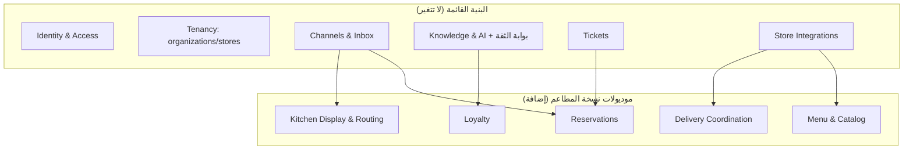
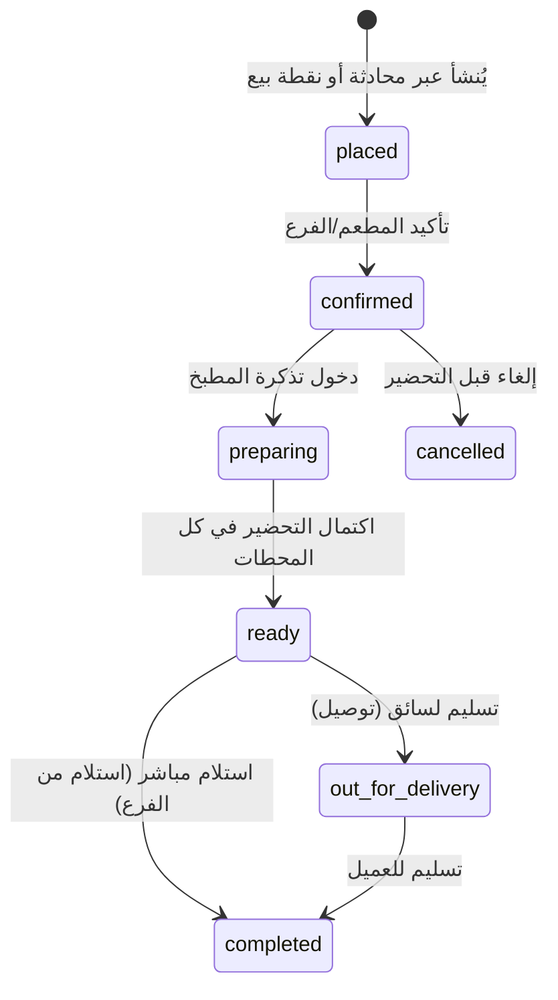
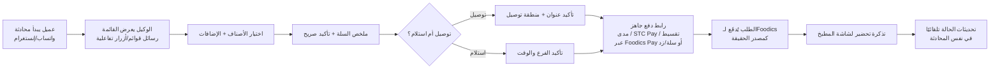

# التوطين للسوق السعودي ونسخة قطاع المطاعم

**الحالة:** فصل استراتيجي تنافسي — مسودة للمراجعة | **يعتمد على:**
[02-architecture.md](02-architecture.md)

هذا الفصل جزء من وثيقة الاستراتيجية التنافسية لمنصة Atlas. يغطي مسارين
يوسّعان قيمة المنصة دون المساس بأي قرار معماري قائم في
[02-architecture.md](02-architecture.md): **(أ)** توطين عميق للسوق
السعودي والخليجي يتجاوز الترجمة السطحية إلى التوافق التنظيمي والتكاملي
الفعلي، و**(ب)** نسخة متخصصة لقطاع المطاعم مبنية بالكامل فوق نفس البنية
المديولارية القائمة (القنوات، صندوق الوارد الموحد، الذكاء الاصطناعي وبوابة
الثقة، التذاكر، تكاملات المتاجر) دون اختراع نظام موازٍ.

## لماذا هذا الفصل: الموقع مقابل منتج أفقي عام

المنتجات المنافسة في هذه المساحة — ومنها **GABSTER AI**، الذي يسوّق نفسه
كمنصة "Arabic-first" لأتمتة واتساب مع تكامل مباشر مع سلّة وزد — تحل مشكلة
ضيقة بعمق محدود: أتمتة الردود على واتساب لأي نشاط تجاري بنفس الآلية
تقريبًا، دون بنية Multi-Tenant حقيقية معلنة، ودون نظام تذاكر/تصعيد بشري
منظم، ودون قاعدة معرفة تخضع لحوكمة موافقة (Approval Loop)، ودون أي عمق
قطاعي (Vertical Depth). هذا نمط "أفقي عام" (Horizontal) بطبيعته: نفس
المنتج يُباع لصالون تجميل ومطعم ومتجر إلكتروني بنفس الشكل تقريبًا.

Atlas مبني من الأساس (انظر [02-architecture.md §1](02-architecture.md#1-النمط-المعماري-modular-monolith-قابل-للتفكك))
كموديولات محدودة الحدود (Bounded Contexts) فوق عزل Multi-Tenant حقيقي على
مستوى قاعدة البيانات (RLS). هذا يعني أن التوطين العميق ونسخة القطاع
العمودي **ليسا إعادة بناء، بل إضافة موديولات وبيانات تهيئة فوق بنية قائمة**
— وهذا بالضبط ما يصعب على منتج أفقي عام تكراره دون إعادة كتابة جوهره.

---

# الجزء الأول: استراتيجية التوطين للسوق السعودي والخليجي

## 1. تجربة عربية أولاً (Arabic-First UX)

التوطين الحقيقي لا يعني "دعم اللغة العربية" كخيار ثانوي فوق تصميم أساسه
إنجليزي، بل اعتبار العربية والـRTL الحالة الافتراضية للتصميم:

- **الاتجاه (RTL) كافتراضي بنيوي لا كطبقة CSS معكوسة:** نظام التصميم
  ([03-design-system.md](03-design-system.md)) يجب أن يُبنى بمنطق RTL أولاً
  (استخدام `start`/`end` بدل `left`/`right` في كل المكوّنات)، بحيث يكون
  دعم LTR لاحقًا (لتوسع خليجي/دولي) هو الحالة المُشتقة، لا العكس — تفادي
  المشكلة الشائعة في المنتجات الأفقية العامة حيث تبدو الواجهة العربية
  "مُترجمة فوق تصميم إنجليزي" (أزرار غير متماثلة، اتجاه أيقونات خاطئ).

- **لهجة ونبرة وكيل الذكاء الاصطناعي قابلة للضبط لكل متجر:** الرد الآلي
  بالفصحى الرسمية الجافة يبدو أحيانًا باردًا لعميل سعودي معتاد على نبرة
  محادثة أقرب للهجة الخليجية المهذّبة. يجب أن تكون "شخصية الوكيل"
  (Persona) إعدادًا على مستوى المتجر ضمن موديول Knowledge & AI — مستوى
  الرسمية (فصحى معيارية / فصحى مبسّطة قريبة من الدارجة الخليجية)، صيغ
  المخاطبة (المفرد المحترم، الجمع التبجيلي، "حضرتك")، وهل يستخدم الوكيل
  عبارات ترحيب/ختام محلية معتادة ("حياك الله"، "الله يسعدك") أم صيغًا
  محايدة. هذا إعداد بيانات (Configuration)، وليس تفرعًا في الكود — يتسق مع
  نمط بوابة الثقة القائم في [02-architecture.md §4](02-architecture.md#4-طبقة-الذكاء-الاصطناعي-وقاعدة-المعرفة).

- **اعتبارات ثقافية في خدمة العملاء:**
  - احترام أوقات الصلاة عند جدولة الرسائل الجماعية/التسويقية التلقائية
    (عدم إرسال حملة أثناء نافذة أذان قريبة) — إعداد جدولة ذكية على مستوى
    المتجر بدل جدولة ثابتة بالساعة فقط.
  - التقويم الهجري إلى جانب الميلادي في كل مكان يظهر فيه تاريخ للعميل
    (تأكيد حجز، تذكير موعد).
  - عطلة نهاية الأسبوع (الجمعة والسبت) كافتراضي في منطق "ساعات العمل"
    و"وقت الاستجابة المتوقع" بدل الافتراض الغربي (سبت-أحد).
  - رمضان كحالة تشغيلية مختلفة فعليًا: ساعات عمل مختلفة، حساسية توقيت
    الرسائل التسويقية (تفصيل في §3 أدناه ضمن الجانب التنظيمي)، ونبرة
    مناسباتية اختيارية للوكيل ("رمضان مبارك") قابلة للتفعيل/التعطيل لكل
    متجر لا افتراضًا معطّلاً للجميع.
  - تجنّب وكيل الذكاء الاصطناعي الإفتاء أو الجزم في مسائل دينية أو قانونية
    خارج نطاق معرفة المتجر — أي سؤال من هذا النوع يجب أن يُصنَّف بثقة
    منخفضة تلقائيًا في بوابة الثقة ويُحوَّل لموظف بشري، بصرف النظر عن وجود
    نص مطابق في قاعدة المعرفة أو عدمه.

- **تنسيق الأرقام والعملة:** الريال السعودي (ر.س / SAR) بصيغته الرسمية بعد
  اعتماد رمزه الجديد، مع خيار عرض الأرقام بالصيغة العربية-الهندية أو
  اللاتينية حسب تفضيل المتجر/العميل، لا افتراضًا واحدًا مفروضًا.

## 2. المشهد التنظيمي السعودي ذو الصلة

هذا القسم يغطي الأنظمة الفعلية التي تمسّ منصة تواصل مع عملاء تخزّن بيانات
شخصية وترسل رسائل تجارية — وهي أنظمة قابلة للتطبيق فعليًا على Atlas إذا
شُغّل لعملاء سعوديين حقيقيين، لا حواشٍ نظرية.

### 2.1 نظام حماية البيانات الشخصية (PDPL) — الجهة المشرفة: SDAIA

نظام حماية البيانات الشخصية دخل حيّز التنفيذ الكامل في 14 سبتمبر 2023،
وانتهت فترة السماح الانتقالية في 14 سبتمبر 2024 — أي أن الامتثال إلزامي
فعليًا الآن لكل جهة تعالج بيانات شخصية لأفراد مقيمين في المملكة، بصرف
النظر عن مكان تأسيس الجهة نفسها (نطاق خارج الحدود صراحة). الجهة الرقابية
والمنفِّذة هي **الهيئة السعودية للبيانات والذكاء الاصطناعي (SDAIA)**.

أهم ما يمسّ Atlas مباشرة كمنصة تخزّن محادثات عملاء وقواعد معرفة:

| المتطلب | الأثر على Atlas |
|---|---|
| التسجيل كـ"جهة تحكم" (Controller) عبر منصة الحوكمة الوطنية للبيانات | كل مؤسسة (Organization) عميلة تحتاج مساعدتها على استيفاء هذا كجزء من التأهيل (Onboarding)، لا مسؤولية Atlas بالنيابة عنها فقط |
| تعيين مسؤول حماية بيانات (DPO) في حالات محددة (معالجة بيانات حساسة بحجم كبير، نقل عابر للحدود، بيانات قُصّر) | حقل تهيئة اختياري على مستوى المؤسسة (بيانات تواصل DPO) + توثيق داخلي لمتى يصبح إلزاميًا حسب حجم العميل |
| إشعار SDAIA خلال 72 ساعة من اكتشاف اختراق بيانات يشكّل خطرًا | يتطلب Runbook تشغيلي مبني على `audit_logs` القائم أصلاً ([02-architecture.md §9](02-architecture.md#9-الأمان-والعزل)) — سجل التدقيق موجود بنيويًا، لكن يلزم إجراء تصعيد وتنبيه رسمي مُعرَّف لا مجرد سجل خام |
| قيود النقل العابر للحدود — لا توجد حتى الآن قائمة "دول معتمدة" منشورة من SDAIA، فأي نقل بيانات خارج المملكة يتطلب عقود قياسية (SCCs) أو قواعد ملزمة معتمدة | **حرج تقنيًا:** أي استدعاء لواجهة نموذج لغوي خارجي لصياغة ردود الوكيل (انظر [02-architecture.md §4](02-architecture.md#4-طبقة-الذكاء-الاصطناعي-وقاعدة-المعرفة) وملاحظة `ANTHROPIC_API_KEY` في `README.md`) يُعد نقلاً محتملاً لبيانات شخصية خارج المملكة إن كانت البنية التحتية للمزوّد خارجها. يلزم توثيق أساس قانوني للنقل لكل عميل مؤسسي حسّاس (قطاع صحي/مالي مثلاً)، وإتاحة خيار "منطقة استضافة بيانات" أو تقليل ما يُرسَل للنموذج الخارجي إلى الحد الأدنى اللازم لصياغة الرد فقط |
| غرامات تصل إلى 5 ملايين ريال + مسؤولية جزائية محتملة | يرفع أولوية بناء "لوحة امتثال" أساسية: سياسة خصوصية لكل مؤسسة، مسار طلب "الوصول لبياناتي/حذف بياناتي" لعميل نهائي، وسياسة احتفاظ (Retention) قابلة للضبط بدل احتفاظ أبدي افتراضي |

### 2.2 الفوترة الإلكترونية (ZATCA / فاتورة) — أثرها غير المباشر

Atlas ليست ولا يجب أن تصبح محرك فوترة ضريبية. لكن الأثر غير المباشر مهم
خصوصًا لنسخة قطاع المطاعم (الجزء الثاني):

- المرحلة الثانية من الفوترة الإلكترونية (مرحلة الربط/التكامل) تُطبَّق على
  دفعات (Waves) متتالية حسب حجم الإيرادات الخاضعة للضريبة، وتستمر موجات
  2026 بجدولة تصل حتى منتصف العام، مع دخول النظام مرحلة تطبيق كامل بلا
  استثناءات اعتبارًا من منتصف 2026. الفواتير يجب أن تحمل ختمًا تشفيريًا
  ورمز QR ومعرّفًا فريدًا (UUID)، وتُرسَل لهيئة الزكاة والضريبة والجمارك
  (ZATCA) عبر منصة "فاتورة" — فورًا للفواتير التجارية (B2B)، وخلال 24 ساعة
  للفواتير الاستهلاكية (B2C).
- **القاعدة التصميمية لـAtlas:** أي فاتورة أو إيصال يظهر للعميل النهائي
  عبر محادثة واتساب يجب أن يكون **مرجعًا مباشرًا لفاتورة صادرة فعليًا من
  نظام نقاط البيع أو منصة التجارة المرتبطة** (Foodics، سلة، زد — وكلها
  تُقر بامتثالها لمتطلبات فاتورة)، لا نصًا يُنشئه Atlas بنفسه. توليد
  "فاتورة موازية" داخل Atlas يخلق خطر تعارض مع السجل الرسمي المعتمد لدى
  ZATCA، وهو خطر لا داعي له لمنصة تواصل وليست نظام فوترة. هذا مبدأ يجب أن
  يُكتب صراحة في تصميم موديول Store Integrations.

### 2.3 تنظيم الاتصالات وحماية المستخدم من الإزعاج التسويقي

الجهة المشرفة على قطاع الاتصالات هي **هيئة الاتصالات والفضاء والتقنية
(CST)** — وهو الاسم الحالي بعد تغييره من "هيئة الاتصالات وتقنية المعلومات
(CITC)" في نوفمبر 2022 عند ضم اختصاصات الفضاء إليها؛ المصادر الأقدم لا
تزال تشير إليها باسمها السابق CITC.

لائحة مكافحة الرسائل المزعجة تشمل — بحسب الضوابط المنشورة للرسائل النصية
القصيرة (SMS) تحديدًا — موافقة مسبقة صريحة من المستلم قبل أي رسالة
تسويقية، بادئة تعريفية إلزامية لهوية المرسل الإعلاني، نافذة زمنية مسموح
بها للإرسال التسويقي (لا يشمل ذلك رسائل الخدمة/الإشعارات التشغيلية)، حد
أقصى لتكرار الرسائل التسويقية يوميًا للمستلم الواحد من نفس الجهة، وخيار
إلغاء اشتراك متاح دائمًا. تختلف نافذة الإرسال المسموح بها خلال شهر رمضان
عن بقية العام تبعًا لتغيّر الإيقاع اليومي للمستخدمين.

**التمييز المهم لـAtlas:** هذه الضوابط منصوصة تحديدًا للرسائل النصية
القصيرة عبر شبكات الاتصالات. منصة واتساب للأعمال تخضع بشكل مباشر لسياسة
ميتا التجارية الخاصة بقوالب الرسائل (فئة "تسويقية" تتطلب موافقة مسبقة
مسجَّلة قبل الإرسال أصلاً كشرط منصّة، لا قانون محلي فقط). لكن **الاتجاه
التنظيمي العام في المملكة نحو مكافحة الإزعاج الرقمي** يجعل تبنّي نفس
المبادئ (موافقة صريحة موثّقة، نافذة إرسال، سقف تكرار يومي) كقاعدة داخلية
لكل بث تسويقي عبر أي قناة في Atlas — لا فقط SMS — قرارًا احترازيًا سليمًا
وليس امتثالاً حرفيًا زائدًا عن الحاجة. هذا يُترجم لموديول حوكمة بث
(Broadcast Governance) يُفصَّل في خارطة الطريق أدناه.

## 3. المشهد التكاملي: سيناريوهات واقعية لا قائمة أسماء

### 3.1 منصة واتساب للأعمال (WhatsApp Business Platform)

Atlas يملك أصلاً محوّل واتساب (`WhatsAppAdapter`) حسب
[02-architecture.md §3](02-architecture.md#3-طبقة-القنوات-نمط-channel-adapter)
و`README.md`. النقاط التي تحتاج قرارات توطين إضافية:

- **الشارة الزرقاء (التوثيق الرسمي، سابقًا "العلامة الخضراء"):** لا تُمنح
  إلا لحسابات تعمل عبر منصة الأعمال الرسمية (API) من خلال مزوّد حلول أعمال
  معتمد (BSP)، وتشترط توثيق هوية المؤسسة عبر Meta Business، موقعًا
  إلكترونيًا فعليًا يمثّل العلامة التجارية، وتقييم جودة رسائل جيد باستمرار
  (معدل حظر منخفض، تسليم مرتفع). نسبة الموافقة منخفضة عمومًا والمعالجة
  تستغرق أسابيع. **الفرصة لـAtlas:** تقديم "مسار توثيق مُدار" كميزة مدفوعة
  للعملاء المؤسسيين — Atlas يهيئ المتطلبات (نصوص، إثباتات) ويتابع الطلب
  نيابة عن المتجر، بدل ترك المتجر يواجه العملية بمفرده.
- **تسعير قائم على تصنيف المحادثة:** التسعير الحالي لكل رسالة/محادثة حسب
  فئتها (تسويقية أعلى تكلفة من خدمية)، مع رفع أسعار فئة التسويق في السوق
  السعودي تحديدًا خلال 2026. هذا يبرر بناء **لوحة مراقبة تكلفة القنوات لكل
  متجر** ضمن Analytics & Reporting — تنبيه عند اقتراب متجر من نمط إنفاق
  مرتفع على رسائل تسويقية، ودمجه مع موديول حوكمة البث في §2.3.
- **تسعير التوثيق الدولي أعلى (Authentication-International):** يُطبَّق
  عند إرسال رمز تحقق (OTP) لرقم في سوق غير السوق المسجَّل له رقم واتساب
  المُرسِل، والمملكة ضمن الأسواق المشمولة بهذا التصنيف. مهم عند تصميم أي
  تدفق تحقق هوية عبر واتساب (مثلاً مرتبط بنافذ، انظر §3.5) لعملاء خارج
  السوق المسجَّل فيه رقم المتجر.

### 3.2 سلّة وزد — من "تكامل" إلى "توزيع"

كلتا المنصتين مدرجتان أصلاً كهدف تكامل في
[02-architecture.md §7](02-architecture.md#7-التكامل-مع-منصات-المتاجر-سلة-زد-shopify-woocommerce)،
ونمط الـAdapter + الكاش المحلي (`synced_orders`/`synced_products`) المصمم
هناك يطابق تمامًا شكل الـwebhooks وواجهات الـREST التي تعرضها كلا
المنصتين فعليًا. الفرصة الإضافية غير المستغلة في التصميم الحالي:

- **سلّة تُشغِّل متجر تطبيقات (App Store) وزد تُشغِّل سوق تطبيقات مشابه
  (Zid App Market)**، بتمييز واضح بين تطبيقات عامة (Public Apps) مُدرجة
  للجميع وتطبيقات خاصة لعميل واحد. إدراج Atlas كتطبيق عام معتمد في كلا
  المتجرين يحوّل التكامل من "عمل تنفيذي لكل عميل" إلى **قناة توزيع
  واكتساب عملاء** — أي تاجر سلّة/زد يستطيع تثبيت Atlas بضغطة دون مبيعات
  مباشرة. هذا يستحق أولوية أعلى من مجرد "دعم تقني" في خارطة الطريق.
- كلا المنصتين تدمج أصلاً بوابات دفع محلية (مدى، STC Pay) ومنصات تقسيط
  (تابي، تمارا) وتقر بالامتثال لمتطلبات فاتورة — ما يعزز مبدأ §2.2: Atlas
  لا يعيد بناء الدفع، بل يقرأ حالة الطلب/الفاتورة الجاهزة من سلّة/زد.

### 3.3 Foodics (نظام نقاط بيع المطاعم)

Foodics شركة سعودية (تأسست في الرياض 2014) تُشغّل عمليات أكثر من 30,000
مطعم في المنطقة، وتوفّر سوق تطبيقات (Foodics Marketplace) بأكثر من 100
تكامل جاهز يشمل منصات توصيل (مثل ربط تلقائي مع طلبات وجاهز عبر تكاملات
وسيطة). هذا هو التكامل المحوري لنسخة قطاع المطاعم (الجزء الثاني) —
يُفصَّل هناك كموديول Store Integration جديد بنفس نمط سلّة/زد تمامًا.

### 3.4 مدى (mada) وSTC Pay — موقف Atlas كطرف غير معالج للدفع

مدى هي شبكة المدفوعات الوطنية التي أسسها البنك المركزي السعودي (ساما)،
وتربط كل نقاط البيع وأجهزة الصراف عبر مفتاح دفع مركزي واحد؛ الانضمام
كتاجر يتم عبر بنك مُقتنٍ (Acquiring Bank) أو مزوّد خدمة دفع مرخّص، بحد
أقصى للعمولة نحو 0.8% من قيمة العملية وحد يومي للبطاقة يبلغ 60,000 ريال.
STC Pay محفظة رقمية بمصادقة عبر رمز مرسل للجوال (OTP)، بدعم للريال
السعودي حصرًا ودون دعم للدفعات المتكررة، وتشير التقديرات إلى إقبال واسع
من التجار على قبولها لتحسّن معدلات إتمام الشراء عبر الجوال.

**القرار الاستراتيجي الصحيح لـAtlas: عدم التحول لمزوّد خدمات دفع.**
معالجة المدفوعات المباشرة تُدخل Atlas في نطاق ترخيص ساما لمزوّدي خدمات
الدفع ومتطلبات PCI-DSS — عبء تنظيمي وتشغيلي لا يخدم جوهر المنتج (منصة
تواصل وذكاء اصطناعي، لا بوابة دفع). البديل العملي المتّسق مع مبدأ §2.2:
Atlas يعرض داخل محادثة واتساب **رابط دفع جاهزًا** صادرًا من نظام مرخّص
فعلاً يدعم مدى وSTC Pay أصلاً (رابط دفع Foodics Pay، أو رابط إتمام طلب
سلّة/زد) بدل بناء تدفق دفع موازٍ.

### 3.5 نفاذ (Nafath) — للتحقق الحسّاس لا للمحادثة الروتينية

نفاذ هو نظام مصادقة الهوية الرقمية الوطني، ويتيح مصادقة متعددة العوامل
عبر تطبيق نفاذ لأكثر من 530 خدمة حكومية وخاصة، بمعدل معالجة يتجاوز 380
مليون طلب تحقق ومتوسط زمن إنجاز نحو 20 ثانية (المستخدم يوافق داخل تطبيق
نفاذ برمز عشوائي مطابق يُعرض له).

**الاستخدام الواقعي المناسب لـAtlas ليس التحقق من كل عميل يراسل واتساب**
— ذلك ثقيل وغير مبرر لمحادثة استفسار عادية — بل حالتان محددتان أعلى
حساسية:

1. **تحقق إضافي (Step-Up) داخل لوحة التحكم الإدارية** لعمليات حسّاسة —
   تغيير صلاحية مالك، الموافقة على معرفة جديدة بنطاق واسع، تصدير بيانات
   عملاء — كطبقة أمان إضافية فوق RBAC القائم
   ([02-architecture.md §8](02-architecture.md#8-الصلاحيات-rbac-على-مستويين)).
2. **تحقق هوية العميل النهائي ضمن سير عمل تذكرة حسّاسة** — نزاع استرداد
   مبلغ كبير، شكوى تتضمن كشف بيانات طلب لعميل آخر بالخطأ — قبل أن يُفصح
   الموظف عن أي بيانات إضافية، بدل الاعتماد فقط على "رقم الجوال نفسه"
   كإثبات هوية ضمني كما تفعل غالبية أدوات المحادثة الأفقية.

### 3.6 أبشر — إدراك السياق لا تكامل مباشر

أبشر منصة خدمات حكومية للمواطنين والمقيمين (الأحوال المدنية، المرور،
إلخ) وليست منصة B2B قابلة للتكامل التجاري المباشر بشكل عام. الاستخدام
الواقعي الوحيد لـAtlas هنا هو على مستوى **الوكيل الذكي**: التعرف على أن
سؤال العميل يقع فعليًا ضمن نطاق خدمة حكومية (تحديث عنوان وطني، تجديد
هوية) لا ضمن نطاق معرفة المتجر، والرد بتوجيه واضح بدل محاولة الإجابة أو
الادعاء بامتلاك تكامل غير موجود. هذا امتداد طبيعي لمبدأ بوابة الثقة —
الثقة المنخفضة هنا سياقية (خارج نطاق الموضوع) لا معرفية فقط.

### 3.7 معروف — إشارة ثقة داخل المحادثة وقائمة تأهيل المتجر

معروف خدمة إلكترونية مجانية من وزارة التجارة (maroof.sa) للتحقق من أن
النشاط التجاري مرخّص وقائم فعليًا عبر سجل تجاري ساري، وتمنح المتاجر
الموثَّقة شارة معروف قابلة للعرض. الوضع الإلزامي الدقيق يختلف حسب نوع
النشاط، لكن الثابت عمليًا أن سلّة وزد والعديد من البنوك وبوابات الدفع
تشترط توثيق معروف لتفعيل ميزات الدفع الإلكتروني الكاملة أو رفع حدود
المعاملات.

فرصتان لـAtlas:

1. **إشارة ثقة داخل الرد الآلي:** حقل "حالة توثيق معروف" ضمن إعدادات
   المتجر، بحيث يستطيع الوكيل الرد تلقائيًا وبثقة على سؤال مثل "هل متجركم
   موثوق؟" بالإشارة لرقم/حالة التوثيق الفعلية، بدل تجاهل السؤال أو تحويله
   لموظف بشري بلا داعٍ.
2. **بند في قائمة تأهيل المتجر الجديد (Onboarding Checklist):** عند إضافة
   متجر جديد لـAtlas يُفعّل قنوات دفع، يُنبَّه مالك المتجر لو لم يكن
   موثَّقًا في معروف بعد — يمنع مفاجأة لاحقة عند محاولة تفعيل ميزات دفع في
   سلّة/زد ترتبط بالفعل بحالة التوثيق.

## 4. خارطة طريق التوطين المقترحة لـAtlas

| المرحلة | المحتوى | لماذا هذا الترتيب |
|---|---|---|
| 0 — الأساس | تدقيق RTL بنيوي في نظام التصميم، إعداد لهجة/نبرة الوكيل لكل متجر، التقويم الهجري، تنسيق الريال | أرخص التغييرات وأعلى أثر إدراكي فوري على تجربة "منتج محلي حقيقي لا مترجم" |
| 1 — الامتثال لحماية البيانات | سياسة خصوصية لكل مؤسسة، مسار طلب وصول/حذف بيانات العميل، إعداد الاحتفاظ بالبيانات، توثيق أساس النقل العابر للحدود لاستدعاءات النموذج اللغوي الخارجي، Runbook إشعار اختراق مبني على `audit_logs` | إلزامي فعليًا الآن (انتهت فترة السماح)، والمخاطرة (غرامات + سمعة) أعلى من أي ميزة تسويقية |
| 2 — حوكمة البث | محرك موافقة صريحة موثّقة، نافذة إرسال قابلة للضبط لكل متجر (بما فيها استثناء رمضان)، سقف تكرار يومي للرسائل التسويقية عبر كل القنوات لا فقط واتساب | يقي من حظر حساب واتساب للمتجر (مخاطرة تشغيلية مباشرة على العميل) قبل أن يكون قرارًا تنظيميًا فقط |
| 3 — إشارات الثقة المحلية | عرض حالة توثيق معروف داخل الرد الآلي وملف المتجر، بند تأهيل جديد للمتاجر | تكلفة تنفيذ منخفضة جدًا، أثر مباشر على تحويل العميل وثقته |
| 4 — التوثيق الرسمي لواتساب | مسار "توثيق مُدار" كميزة مدفوعة (الشارة الزرقاء)، لوحة مراقبة تكلفة المحادثات لكل متجر | يعتمد على استقرار حجم رسائل كافٍ لتبرير الجهد لكل عميل |
| 5 — التوزيع عبر متاجر التطبيقات | إدراج Atlas كتطبيق عام معتمد في متجر تطبيقات سلّة وسوق تطبيقات زد | يحوّل التكامل القائم أصلاً إلى قناة اكتساب عملاء بأقل تكلفة تسويقية |
| 6 — تحقق الهوية الحسّاس | دمج نفاذ كطبقة Step-Up للإجراءات الإدارية الحسّاسة وتذاكر النزاعات عالية القيمة | يستهدف شرائح مؤسسية/عملاء أكبر لاحقًا، ليس أولوية للمتاجر الستة الحالية |

---

# الجزء الثاني: نسخة Atlas لقطاع المطاعم

## 5. لماذا قطاع عمودي وليس مجرد "إعدادات إضافية"

أداة أفقية عامة مثل الأدوات المنافسة تستطيع إضافة "قالب رد جاهز للمطاعم"،
لكنها لا تستطيع بسهولة نمذجة كيانات قطاعية حقيقية — عناصر قائمة طعام
بمكوّنات وإضافات، طاولات وسعات حجز، محطات تحضير في المطبخ، مناطق توصيل —
دون أن تتحول عمليًا لمنتج مختلف. Atlas يملك بالفعل الأساس البنيوي المناسب
لهذا التخصص: نمط الموديولات محدودة الحدود
([02-architecture.md §1](02-architecture.md#1-النمط-المعماري-modular-monolith-قابل-للتفكك))
يسمح بإضافة موديولات قطاعية جديدة (قائمة الطعام، الحجوزات، شاشة المطبخ،
تنسيق التوصيل، الولاء) **دون لمس** موديولات Identity & Access وTenancy
وChannels & Inbox وKnowledge & AI وTickets القائمة.

## 6. البنية: الموديولات الإضافية فوق البنية الحالية

| الموديول الجديد | يُبنى فوق | إضافة لا تعديل |
|---|---|---|
| Menu & Catalog | Store Integrations (نمط سلّة/زد) | كاش محلي لعناصر القائمة والمكوّنات، بنفس فلسفة `synced_products` |
| Reservations | Tickets + صندوق الوارد الموحد | حجز = كيان جديد يُبلَّغ عبر نفس قناة المحادثة القائمة |
| Kitchen Display & Routing | ناقل الأحداث الداخلي لصندوق الوارد (Pub/Sub) | نفس آلية "بث الرسالة الجديدة لكل مُشاهِد" تُستخدم لبث تذكرة تحضير لشاشة المطبخ بدل موظف بشري |
| Delivery & Driver Coordination | Store Integrations + `synced_orders` | حالة الطلب تُقرأ من الكاش المحلي وتُدفع تلقائيًا كرسالة للعميل، بنفس منطق §7 من [02-architecture.md](02-architecture.md#7-التكامل-مع-منصات-المتاجر-سلة-زد-shopify-woocommerce) |
| Loyalty | Knowledge & AI (للاستعلام) + Tickets (للاسترداد المتنازع عليه) | رصيد نقاط يُقرأ كسياق إضافي لبوابة الثقة عند الرد على استفسار العميل |
| Multi-Branch | Tenancy (`organizations`/`stores`) | **بلا حاجة لتعديل مخطط جديد** — العلامة التجارية = `organization`، كل فرع = `store` قائم أصلاً، والعزل بـRLS يعمل بلا تغيير |
| Inventory (أساسي) | Store Integrations (قراءة فقط من Foodics) | Atlas لا يدير المخزون، يقرأ إشارة "نفد" لتعطيل عنصر في محادثة الطلب فورًا |

## 7. الحجوزات (Reservations)

العميل يحجز داخل نفس محادثة واتساب/إنستغرام التي يستخدمها للاستفسار
العادي — لا تطبيق حجز منفصل. مثال تدفق: عميل يكتب "أبي أحجز طاولة الجمعة
الساعة ٨ لأربعة أشخاص" → الوكيل يحلّل الطلب مقابل سعة الفرع المحدد وجدول
الحجوزات → إن توفّر الموعد يؤكد فورًا ويُنشئ سجل حجز، وإن كان غامضًا
(فرع غير محدد، سعة غير متاحة) يُصنَّف بثقة متوسطة/منخفضة ويُحوَّل للموظف
مع الاحتفاظ بسياق المحادثة كاملاً — نفس مسار بوابة الثقة القائم بلا أي
منطق جديد. تذكير تلقائي قبل الموعد عبر نفس القناة، وتتبّع حالات عدم
الحضور (No-Show) كإشارة اختيارية تُدخَل في تقييم برنامج الولاء.

## 8. شاشة المطبخ وتوجيه الطلبات (Kitchen Display & Order Routing)

لوحة مباشرة لكل محطة تحضير (مشاوي، مقبلات باردة، مشروبات...) تستقبل
تذاكر تحضير من كل مصدر طلب موحّد — طلب عبر واتساب، طلب عبر نظام نقاط
البيع مباشرة، أو طلب داخل الفرع. آلية التوجيه: كل عنصر بالطلب يحمل وسم
"محطة التحضير" ضمن Menu & Catalog، فيُوزَّع الطلب تلقائيًا للمحطات
المعنية عند إنشائه، وتُبث كل تذكرة عبر نفس ناقل الـPub/Sub الداخلي
المستخدم أصلاً لبث الرسائل الجديدة في صندوق الوارد الموحد
([02-architecture.md §5](02-architecture.md#5-صندوق-الوارد-الموحد)) —
فرق واحد فقط أن "المُشاهِد" هنا شاشة مطبخ بدل موظف خدمة عملاء. عند اكتمال
التحضير في كل المحطات، يُبث تحديث تلقائي لفريق التسليم/التوصيل وللعميل
في نفس محادثته.

## 9. تكامل نقاط البيع (Foodics)

يُبنى كمحوّل تكامل جديد (`FoodicsAdapter`) بنفس نمط سلّة/زد تمامًا
([02-architecture.md §7](02-architecture.md#7-التكامل-مع-منصات-المتاجر-سلة-زد-shopify-woocommerce)):
مزامنة فورية عبر webhook عند تغيّر حالة الطلب، مزامنة احتياطية دورية،
وكاش محلي يوسّع `synced_orders`/`synced_products` القائمين ليشملا عناصر
القائمة والطاولات والمخزون على مستوى المكوّن. الاتجاه الأهم: أي طلب
يُنشأ داخل Atlas عبر محادثة عميل (§13 أدناه) **يُدفَع إلى Foodics كمصدر
الحقيقة الوحيد للفوترة والتحضير والامتثال الضريبي** — Foodics تُقر
بامتثالها لمتطلبات فاتورة، فلا داعي لأي منطق فوترة موازٍ داخل Atlas
(اتساقًا مع مبدأ §2.2 في الجزء الأول).

## 10. التوصيل وتنسيق السائقين

إعداد مناطق توصيل وأسعارها لكل فرع، وتعيين السائق (سائق داخلي تابع
للمطعم، أو عبر تكاملات التوصيل الخارجية التي يدعمها سوق تطبيقات Foodics
أصلاً مع منصات التوصيل الإقليمية الشائعة). حالة الطلب ("مع السائق"،
"الوصول خلال 15 دقيقة") تُدفع تلقائيًا لمحادثة العميل نفسها عبر نفس آلية
التحديث التلقائي المبنية أصلاً لحالة الطلبات في موديول Store Integrations
— لا حاجة لتطبيق تتبّع منفصل يطلب العميل تثبيته.

## 11. برامج الولاء

نقاط/مستويات قابلة للضبط على مستوى العلامة التجارية (`organization`) أو
الفرع (`store`)، مع إمكانية استرجاع الرصيد داخل المحادثة نفسها ("كم نقطة
عندي؟") عبر بوابة الثقة بنفس آلية استرجاع بيانات الطلب من الكاش المحلي.
الاسترداد (تحويل نقاط لخصم) واستفسارات النزاع (نقاط لم تُضَف لطلب سابق)
تُدار كتذاكر عبر موديول Tickets القائم لضمان مراجعة بشرية عند الحاجة.
أي حملة تسويقية للولاء (تذكير بنقاط منتهية الصلاحية، عرض بمناسبة) تمر
إلزاميًا عبر موديول حوكمة البث المذكور في §4 من الجزء الأول.

## 12. إدارة الفروع المتعددة

هذه أصلاً قدرة قائمة في تصميم Tenancy —
[02-architecture.md §2](02-architecture.md#2-استراتيجية-multi-tenant)
يعرّف `organization` كعلامة تجارية تضم عدة `stores`، والعزل بـRLS يعمل
حاليًا لعزل المتاجر الستة عن بعضها. في سياق مطعم متعدد الفروع، `store`
يصبح "فرعًا" حرفيًا، ودور `owner` (نطاقه "مؤسسة كاملة" في مصفوفة الأدوار
بـ[02-architecture.md §8](02-architecture.md#8-الصلاحيات-rbac-على-مستويين))
يصبح "مدير العلامة التجارية" الذي يرى تقارير مجمّعة عبر كل الفروع فورًا،
دون أي تعديل مخطط أو منطق عزل جديد — فقط تسمية تشغيلية مختلفة لنفس البنية.

## 13. أساسيات المخزون

Atlas لا يعيد بناء إدارة مخزون كاملة (Foodics تدير هذا فعليًا حتى مستوى
المكوّن الواحد ضمن الوصفة). دور Atlas هنا محدد وحرج: **استهلاك إشارة
النفاد فورًا** من الكاش المحلي المُزامَن مع Foodics لتعطيل أي عنصر قائمة
نفد مخزونه من إجابات/طلبات الوكيل الذكي تلقائيًا ("عذرًا، هذا الصنف غير
متوفر اليوم") — هذا يمنع أخطر سيناريو ثقة في الطلب عبر محادثة: أن يقبل
الوكيل طلبًا لعنصر غير موجود فعليًا في المطبخ.

## 14. إدارة الطلبات

دورة حياة الطلب تُبنى بنفس منطق دورة حياة التذكرة القائمة
([02-architecture.md §6](02-architecture.md#6-دورة-حياة-التذكرة))
مع حالات مطابقة لسياق المطعم بدل سياق الدعم:

كل انتقال حالة يُسجَّل بنفس فلسفة `ticket_events` القائمة، ويُبث تلقائيًا
كتحديث نصي مختصر داخل محادثة العميل نفسها.

## 15. معالجة الشكاوى

يُعاد استخدام مسار بوابة الثقة والتصعيد التلقائي للتذاكر حرفيًا دون أي
منطق جديد ([02-architecture.md §4](02-architecture.md#4-طبقة-الذكاء-الاصطناعي-وقاعدة-المعرفة)
و[§6](02-architecture.md#6-دورة-حياة-التذكرة)): رسالة شكوى ("الطلب وصل
ناقص") تُصنَّف بثقة منخفضة تلقائيًا (نمط لغوي شكوى وليس استفسارًا)، فتُنشأ
تذكرة موسومة "شكوى" وتُحوَّل لمدير الفرع المعني (لا لأي موظف عشوائي — عبر
نفس RBAC القائم)، مع قوالب تعويض قياسية (قسيمة، استرداد جزئي، نقاط ولاء
تعويضية) قابلة للربط بموديول الولاء في §11.

## 16. النادل الذكي (AI Waiter)

ليس نظامًا منفصلاً، بل **امتداد لصلاحيات وكيل الذكاء الاصطناعي القائم**
فوق قاعدة معرفة مصدرها قائمة الطعام المُزامَنة فعليًا (لا نص ثابت يصبح
قديمًا)، بإضافة قدرة فعل (Action) واحدة جديدة فوق قدرة الإجابة القائمة:
إنشاء "طلب مسودة" (Draft Order) بدل الاكتفاء بالرد النصي. الاقتراحات
البيعية الإضافية (Upsell — "تحب تضيف مشروب أو حلا؟") تُبنى كقواعد ربط
بسيطة بين عناصر القائمة، تُطرَح فقط بعد اختيار العميل لعناصر رئيسية.

**قيد أمان إلزامي:** الوكيل لا يُثبّت أي طلب نهائيًا دون خطوة تأكيد صريحة
من العميل (ملخّص الطلب + السؤال "أأكّد الطلب؟") — بصرف النظر عن مستوى ثقة
الوكيل في فهم الطلب، لأن الفعل هنا (إنشاء التزام مالي) أعلى خطورة من مجرد
الرد على استفسار، فيستحق بوابة تأكيد صريحة إضافية فوق بوابة الثقة
القياسية لا بديلاً عنها.

## 17. الطلب الصوتي (مفهوم أولي)

الرسائل الصوتية عبر واتساب نوع رسالة أصلي مدعوم أصلاً من المنصة. الامتداد
المعماري المقترح: إضافة مرحلة تحويل صوت-لنص (تُراعي اللهجة الخليجية) عند
دخول رسالة صوتية إلى دالة `normalizeInbound()` في محوّل القناة
([02-architecture.md §3](02-architecture.md#3-طبقة-القنوات-نمط-channel-adapter))
— بحيث تُعامَل الرسالة المحوَّلة كنص عادي بعد ذلك، ويبقى بقية خط الأنابيب
(بحث RAG، بوابة الثقة، قدرة الطلب في §16) بلا أي تعديل. هذا يُطرح كمرحلة
لاحقة (Phase 2) لا التزام مرحلة أولى، لأن دقة تحويل اللهجات صوتيًا لا
تزال أقل موثوقية من النص — أي طلب صوتي غامض يجب أن يُوجَّه تلقائيًا لمسار
الثقة المنخفضة (تحويل لموظف) بدل محاولة تخمين قسري.

## 18. تدفق الطلب الأصلي عبر واتساب (WhatsApp-Native Ordering Flow)

كل خطوة هنا تُعاد استخدامًا من بنية قائمة: عرض القائمة والتأكيد جزء من
Knowledge & AI + بوابة الثقة، رابط الدفع تفويض لنظام مرخّص لا معالجة
مباشرة (§3.4 من الجزء الأول)، الدفع لـFoodics هو نمط Store Integrations
القائم، وتحديثات الحالة هي نفس آلية صندوق الوارد الموحد. **لا يوجد أي
مكوّن جديد هنا يخرج عن الأنماط المعمارية الموثّقة أصلاً في**
[02-architecture.md](02-architecture.md).

## 19. خارطة تنفيذ مقترحة لنسخة المطاعم

1. Menu & Catalog كموديول مستقل + محوّل Foodics الأساسي (قراءة قائمة
   وحالة طلب فقط).
2. تدفق الطلب عبر واتساب (§18) بالحد الأدنى: عرض قائمة، سلة، تأكيد، رابط
   دفع خارجي.
3. شاشة المطبخ وتوجيه الطلبات (يعتمد على وجود طلبات فعلية من الخطوة 2).
4. إدارة الطلبات ومعالجة الشكاوى (تُعاد استخدامًا شبه كاملة من Tickets
   القائم — أقل الموديولات تكلفة تنفيذ).
5. الحجوزات.
6. إدارة الفروع المتعددة (تفعيل تسمية/تقارير فقط — البنية جاهزة أصلاً).
7. التوصيل وتنسيق السائقين.
8. برامج الولاء.
9. النادل الذكي — قدرة الطلب والاقتراح البيعي فوق الوكيل القائم.
10. الطلب الصوتي — مرحلة استكشافية لاحقة، مشروطة بنضج دقة تحويل اللهجات.

---

## خلاصة الموقع التنافسي

التوطين العميق (الجزء الأول) يرفع تكلفة تقليد Atlas من قِبل أدوات أفقية
عامة، لأنه يتطلب استثمارًا تنظيميًا وتشغيليًا لا مجرد ترجمة واجهة. نسخة
قطاع المطاعم (الجزء الثاني) ترفع الحاجز أكثر، لأنها تتطلب أصلاً بنية
Multi-Tenant وموديولات محدودة الحدود قابلة للتوسعة — وهو ما تفتقر إليه
الأدوات الأفقية بحكم تصميمها العام لا بحكم نقص جهد. النتيجتان معًا تحوّلان
Atlas من "أداة أتمتة ردود" إلى **منصة تشغيل قطاعية متعددة الفروع** يصعب
استبدالها بأداة بديلة أرخص وأعم.

## مصادر مرجعية

- الهيئة السعودية للبيانات والذكاء الاصطناعي (SDAIA) — نظام حماية البيانات
  الشخصية: `dgp.sdaia.gov.sa`
- هيئة الزكاة والضريبة والجمارك (ZATCA) — الفوترة الإلكترونية: `zatca.gov.sa`
- هيئة الاتصالات والفضاء والتقنية (CST، سابقًا CITC): `cst.gov.sa`
- البنك المركزي السعودي (ساما) — شبكة مدى: `sama.gov.sa`، `mada.com.sa`
- منصة نفاذ للهوية الرقمية الوطنية، ومنصة معروف (وزارة التجارة):
  `maroof.sa`
- توثيق مطوّري سلّة (`docs.salla.dev`) وزد (`developers.zid.sa`)
- توثيق منصة واتساب للأعمال (Meta for Developers)
- الموقع العام لمنصة GABSTER AI ومدونتها (`gabster.ai`) — للاطلاع على
  الوضع التسويقي العام المُعلَن فقط، دون أي وصول أو اختبار غير عام
